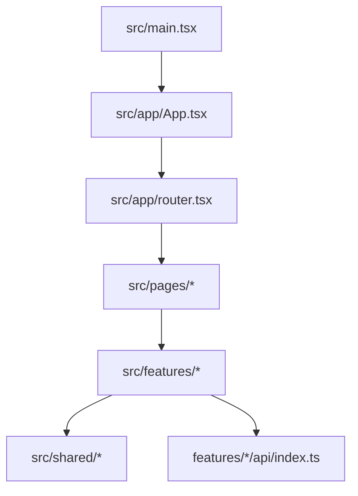
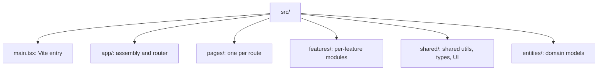
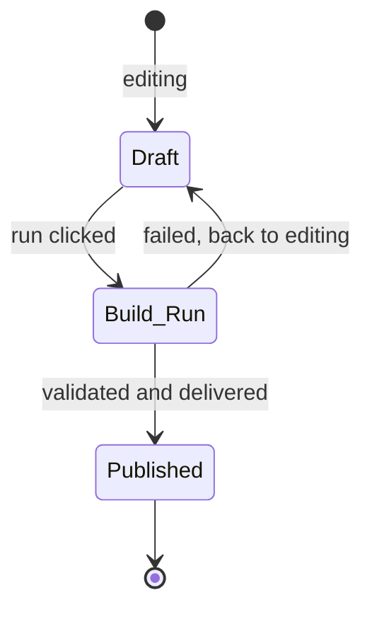

# AGENTS.md — kpubdata-studio

> **[POLICY.md](https://github.com/yeongseon/kpubdata/blob/main/docs/governance/POLICY.md)
> is the single canonical source for project-management and review policy.** Epic,
> Issue, Priority, Review Level, Verification and Release rules come from there.
> This file keeps only what is specific to this repository — build commands and
> directory rules. POLICY.md wins any conflict.

## Mission

Implement KPubData Studio: the UI shell and workflow interface for
`kpubdata-builder`.

## Ground rules

- Studio does not reimplement builder logic.
- Keep UI state transitions explicit.
- Generated specs must be portable.
- Surface validation results and the manifest, do not bury them.
- Treat preview as a core feature, not a nice-to-have.

## Language policy

> [kpubdata ADR 0003](https://github.com/yeongseon/kpubdata/blob/main/docs/adrs/0003-language-policy.md)
> is canonical. The evidence (measurements across ten Korean OSS projects) and the
> rejected alternatives are there.

**Titles are English; bodies are free.** Titles show up in lists, searches and
release notes.

| Area | Language |
|---|---|
| Code identifiers, comments, JSDoc | English |
| Commit messages | English |
| **PR titles** | English (Conventional Commits) — a squash merge turns it into a commit |
| CHANGELOG and release notes | English |
| **Governance documents** (`AGENTS.md`, `CONTRIBUTING.md`) | English |
| **Implementation contracts** (`PROVIDER_ADAPTER_CONTRACT.md`, `API_SPEC.md`) | English |
| **Design rationale** (`VALIDATION.md`, `ARCHITECTURE.md`, ADRs) | Korean |
| **README** | Korean first, with an English section in the same file |
| **Issue titles** | English |
| Issue bodies | Korean or English |
| PR bodies and review comments | Korean or English |
| Korean-domain documents (활용신청, 공공누리 procedures) | Korean |
| User-visible string literals | **Out of scope** — runtime behaviour, decided separately |

That last row matters most here. Studio is the repository users actually see, so
**a Korean UI label is not a violation.** Translating one would change the product,
which is a separate decision (#427).

Operating rules:

- Answer an issue in the language it was written in.
- Write `good first issue` in English, or in both.
- **Do not let English block a contribution.** If a title is hard to write in
  English, open it in Korean and say so — triage and review will sort it out.


## 확인은 기계가 한다

[POLICY 18.2](https://github.com/yeongseon/kpubdata/blob/main/docs/governance/POLICY.md) and [VERIFICATION.md](https://github.com/yeongseon/kpubdata/blob/main/docs/governance/VERIFICATION.md) are canonical. Three rules
carry most of the weight:

- **A sentence with a number in it comes from a command.** Run it in the same breath
  and paste the output. A figure recalled from memory is not a figure.
- **Sweep with `git ls-files`, not with paths you chose.** Ask the repository what it
  has. A hand-written path list is how `__tests__/` got missed.
- **A rule without a gate is a wish.** When you add a rule, add the command that
  checks it, wire it into CI, and write the test that shows it failing. Without the
  third, nobody knows the gate works.
- **An absent check is not a failure — it is a stop.** A required status check no
  workflow produces leaves every pull request BLOCKED for ever, because GitHub waits
  for it rather than reporting it. The way past is `--admin`, which skips every other
  check too. Require the one aggregate `CI gate` job, never a matrix-suffixed name,
  and run `scripts/check_required_checks.py` (in kpubdata) after touching a matrix.

Existing debt is frozen with a **ratchet** — the baseline holds today's per-file
count and the check fails only when a count grows. Fixing everything first means
starting nothing.

Say "done" with the command's output. If tests failed, paste the failure. If a step
was skipped, say it was skipped.

## Labels — what an agent applies

**[POLICY.md](https://github.com/yeongseon/kpubdata/blob/main/docs/governance/POLICY.md) sections 2.1, 2.1.1 and 2.1.2 are the label reference.**
This file deliberately does not copy the table: a second copy goes stale, and the
first draft of this section already dropped the Severity axis that POLICY defines.

What is specific to agents:

- A new issue carries **at least one `epic:*`**. Its title starts with a
  Conventional Commits type — `fix(localdata): empty wrapper becomes a phantom row` —
  and the `type:*` label follows from the title (POLICY 2.1.3). **Never set `type:*`
  by hand**, and change the title rather than the label when the type was wrong.
- Pull request titles use the same types; the `PR title` check fails otherwise. The
  allowed list lives in kpubdata's `scripts/conventional_title.py`, and the rules in
  kpubdata's POLICY 2.1.3 — the one place all three repositories read. Merges are
  squash-only, so the PR title becomes the commit title on `main`. Do not put an issue
  number in a PR title; write `Closes #N` in the body.
- Leave Priority off when there is no evidence for it. POLICY 8 requires
  `Impact:`, `Blocks:` and `Evidence:` for High and above, and a rating without
  evidence is a wrong rating.
- Do not prefix a title with `GOV-01:` or `WH-03:`. Those are serial numbers from
  a backlog document, not the issue's name. The type is the only prefix.

What an agent does not do:

- Promote to `priority:high` or `priority:critical` — that is a person's judgement
  (POLICY 8, 14).
- Create a label that POLICY's table does not list. Adding one goes through
  `epic:governance`.
- Lower a `review:*` level.
- Create an Epic issue. Epic is a label (POLICY 4.1).
- Substitute `P0`/`P1`/`P2` mechanically for `priority:*`. POLICY 8 requires a
  re-rating from zero, so that a wrong priority does not survive under a new name.

## Branch rules

- The default branch is `main`. **Never push to `main` directly.** Branch
  protection now enforces this, so a direct push is refused rather than merely
  discouraged.
- Always work on a feature branch and open a PR.
- Branch names: `feat/issue-<number>-<short-description>`,
  `fix/issue-<number>-<short-description>`, `docs/<short-description>`.
- Never force-push to `main`. Never delete `main`.
- Do not rename or delete a branch you did not create.
- If a git operation is not obviously safe, **ask instead of guessing.**

## Releases

Cadence and order live in [kpubdata's compatibility.md §5.1](https://github.com/yeongseon/kpubdata/blob/main/docs/compatibility.md#release-cadence);
who may do what lives in POLICY 14. This section keeps only what applies to an
agent.

- **Release week is a freeze.** From the Monday of the month's last week until
  kpubdata-studio is released on Thursday, open only release pull requests against
  `main`: version, CHANGELOG, dependency pin, compatibility documents, or a fix for
  a failing release gate. Other work waits on its branch.
- **Prepare, do not release.** An agent may tidy the CHANGELOG's Unreleased section,
  run a release workflow with `dry_run`, and draft the version and pin pull requests.
  Pushing a tag, creating a GitHub Release, approving the PyPI environment and
  changing what a release contains are a person's (POLICY 14).
- **Propose the bump from the CHANGELOG, with the reason.** In 0.x, a breaking change
  or a new feature is minor; fixes alone are patch.
- **Write what a release changes under `## [Unreleased]` in `CHANGELOG.md`, as you
  merge it.** The prepare job dates that section and the release job publishes it as
  the notes. An empty `[Unreleased]` stops the release — Studio included, when it only
  follows Builder's version: say so in a line.
- **Builder and Studio share one version** (ADR 0004). They ship as one application,
  so a release that only changed one of them still raises both. Skipping a repository
  because it has no changes applies to kpubdata alone.
- **Target Release is a month (`2026-10`), not a version.**

## Build order

1. Information architecture
2. Build draft state
3. The builder API integration layer
4. Preview and validation screens
5. The artifact viewer
6. The publish flow

---

## How this project fits together

`kpubdata-builder` runs the pipeline; Studio is where a person decides what to
build, watches it run, and looks at what came out before publishing it. No code is
written by the user.

### Vocabulary

| Term | Meaning |
| :--- | :--- |
| **Draft** | An unsaved, in-progress build definition |
| **Build Run** | An actual build execution fetching data |
| **Preview** | The screen showing what a build produced |
| **State Model** | The flow from Draft through Run to Published |
| **Studio Shell** | The frame and navigation every screen sits in |
| **UI Spec** | The contract for how each element looks and responds |

### Request flow (Vite + React SPA)



```text
[main.tsx] -> [App.tsx] -> [router.tsx] -> [pages/*] -> [features/*]
```

## Agent coding rules

### Prompts that work

- "Lay out the new-build screen in `src/pages/NewBuildPage.tsx`."
- "Add the preview panel that talks to `src/features/preview/api/index.ts`."

### Forbidden

- **Duplicating builder logic.** Call the `kpubdata-builder` API; do not write
  collection logic here.
- **Losing state.** A Draft survives navigation.

### Before handing work back

- [ ] Does `npm run lint` pass?
- [ ] Is a new page reachable from the sidebar navigation?
- [ ] Does the layout hold up at phone width?

## Directory layout



```text
src/
├── main.tsx         # Vite entry point
├── app/             # App assembly and React Router setup
├── pages/           # one component per URL
├── features/        # per-feature UI, API and state
├── shared/          # shared utilities, types, UI pieces
└── entities/        # build, dataset, manifest, artifact models
```

### Which file to change

- **A new screen (URL)**: add a component under `src/pages/` and wire the route in
  `src/app/router.tsx`.
- **The shell every screen shares**: `src/app/App.tsx` or the app shell in
  `src/app/router.tsx`.
- **A feature's API, state or UI**: work inside that `src/features/<feature>/`.

## SPA notes

### What each entry file does

- `main.tsx` mounts the application onto `#root`.
- `App.tsx` wraps the app and connects `RouterProvider`.
- `router.tsx` maps browser paths to page components.
- `src/pages/*.tsx` are the screens.
- `src/features/*` groups one feature's API, UI and state.

### Adding a page

1. Create the component under `src/pages/`.
2. Register it with a path in `src/app/router.tsx`.
3. Open that path on `localhost:5173`.

### The state model



- **Draft** — the user is still editing.
- **Build Run** — data is being collected.
- **Published** — validation passed and the result is shared.

---

## Related documents

### In this repository

| Document | What it covers |
| :--- | :--- |
| [CONTRIBUTING.md](./CONTRIBUTING.md) | How to contribute |
| [ARCHITECTURE.md](./ARCHITECTURE.md) | System architecture |
| [STATE_MODEL.md](./STATE_MODEL.md) | State model |
| [UI_SPEC.md](./UI_SPEC.md) | UI specification |
| [USER_FLOWS.md](./USER_FLOWS.md) | User flows |
| [INFORMATION_ARCHITECTURE.md](./INFORMATION_ARCHITECTURE.md) | Information architecture |
| [API_CONTRACT.md](./API_CONTRACT.md) | API contract |
| [PRD.md](./PRD.md) | Product requirements |
| [ROADMAP.md](./ROADMAP.md) | Roadmap |
| [SECURITY.md](https://github.com/yeongseon/kpubdata-studio/blob/main/SECURITY.md) | Security policy and known limits |

### KPubData product family

| Repository | Document | What it covers |
| :--- | :--- | :--- |
| [kpubdata](https://github.com/yeongseon/kpubdata) | [AGENTS.md](https://github.com/yeongseon/kpubdata/blob/main/AGENTS.md) | Core agent guide |
| [kpubdata-builder](https://github.com/yeongseon/kpubdata-builder) | [AGENTS.md](https://github.com/yeongseon/kpubdata-builder/blob/main/AGENTS.md) | Builder agent guide |
