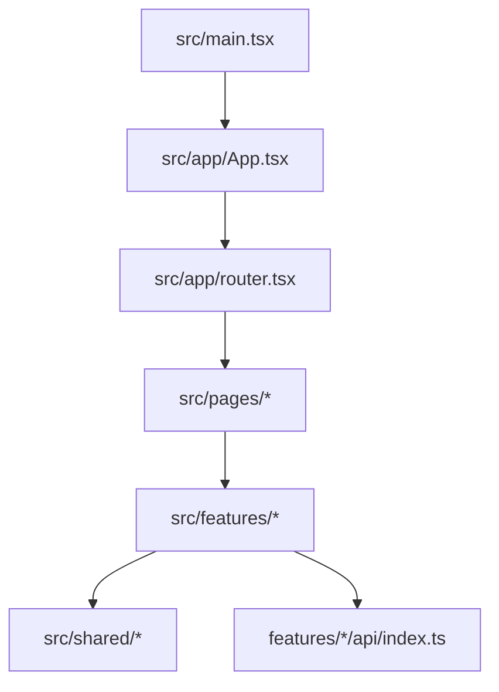
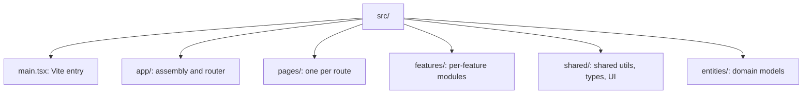
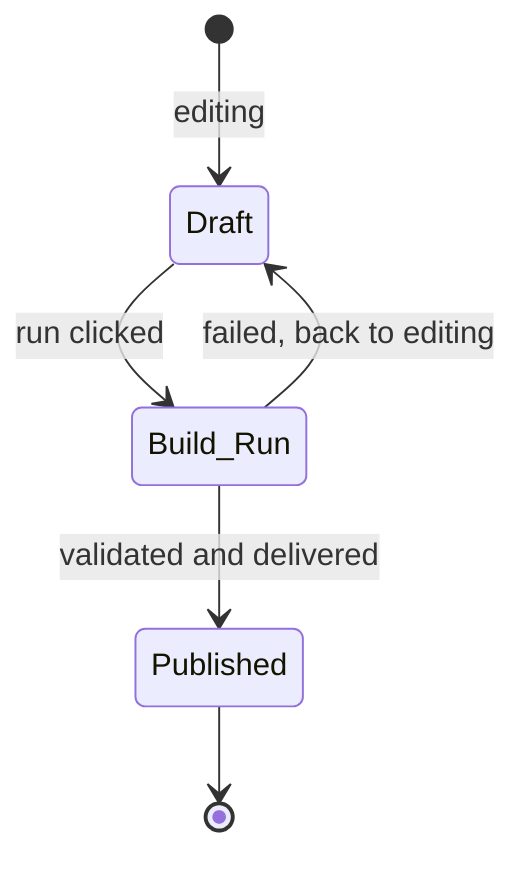

# AGENTS.md — kpubdata-studio

> **[POLICY.md](https://github.com/yeongseon/kpubdata/blob/main/docs/governance/POLICY.md)
> is the single canonical source for project-management and review policy.** Epic,
> Issue, Priority, Review Level, Verification and Release rules come from there.
> This file keeps only what is specific to this repository — build commands and
> directory rules. POLICY.md wins any conflict.

## Mission

Implement KPubData Studio: the UI shell and workflow interface for
`kpubdata-builder`.

## Ground rules

- Studio does not reimplement builder logic.
- Keep UI state transitions explicit.
- Generated specs must be portable.
- Surface validation results and the manifest, do not bury them.
- Treat preview as a core feature, not a nice-to-have.

## Language policy

> [kpubdata ADR 0003](https://github.com/yeongseon/kpubdata/blob/main/docs/adrs/0003-language-policy.md)
> is canonical. The evidence (measurements across ten Korean OSS projects) and the
> rejected alternatives are there.

**Titles are English; bodies are free.** Titles show up in lists, searches and
release notes.

| Area | Language |
|---|---|
| Code identifiers, comments, JSDoc | English |
| Commit messages | English |
| **PR titles** | English (Conventional Commits) — a squash merge turns it into a commit |
| CHANGELOG and release notes | English |
| **Governance documents** (`AGENTS.md`, `CONTRIBUTING.md`) | English |
| **README** | Korean first, with an English section in the same file |
| **Issue titles** | English |
| Issue bodies | Korean or English |
| PR bodies and review comments | Korean or English |
| Korean-domain documents (활용신청, 공공누리 procedures) | Korean |
| User-visible string literals | **Out of scope** — runtime behaviour, decided separately |

That last row matters most here. Studio is the repository users actually see, so
**a Korean UI label is not a violation.** Translating one would change the product,
which is a separate decision (#427).

Operating rules:

- Answer an issue in the language it was written in.
- Write `good first issue` in English, or in both.
- **Do not let English block a contribution.** If a title is hard to write in
  English, open it in Korean and say so — triage and review will sort it out.

## Labels — what to apply

POLICY sections 2.1, 2.1.1 and 2.1.2 are canonical. **Do not create a label that
is not in the table below.** Adding one goes through `epic:governance`.

| Axis | Labels | Who |
|---|---|---|
| Epic | `epic:trust` `epic:warehouse` `epic:governance` `epic:byok` `epic:policy` `epic:datasets` `epic:distribution` `epic:brand` `epic:onboarding` | Anyone may apply an existing label. **Only a person creates a new `epic:*`** |
| Priority | `priority:critical` `priority:high` `priority:medium` `priority:low` | **Only a person promotes to High or above** (POLICY 8) |
| Review Level | `review:R0` – `review:R3` | Assigned by path. **Only a person lowers one** |
| Type | `type:feat` `type:bug` `type:docs` `type:chore` `type:test` `type:refactor` | Anyone |
| Area | `area:*` | Anyone |

A new issue carries **at least `epic:*` and `type:*`**. Leave Priority off when
there is no evidence for it — POLICY 8 requires `Impact:`, `Blocks:` and
`Evidence:` for High and above, and a rating without evidence is a wrong rating.

What an agent does not do:

- Promote to `priority:high` or `priority:critical` — that is a person's judgement.
- Create a new `epic:*` label.
- Lower a `review:*` level.
- Create an Epic issue. Epic is a label (POLICY 4.1).

`P0` / `P1` / `P2` are **retired.** Do not substitute them mechanically for
`priority:*` — POLICY 8 requires a re-rating from zero, so that a wrong priority
does not survive under a new name.

Do not prefix a title with `GOV-01:` or `WH-03:`. Those are serial numbers from a
backlog document, not the issue's name. Labels do the classifying.

## Branch rules

- The default branch is `main`. **Never push to `main` directly.** Branch
  protection now enforces this, so a direct push is refused rather than merely
  discouraged.
- Always work on a feature branch and open a PR.
- Branch names: `feat/issue-<number>-<short-description>`,
  `fix/issue-<number>-<short-description>`, `docs/<short-description>`.
- Never force-push to `main`. Never delete `main`.
- Do not rename or delete a branch you did not create.
- If a git operation is not obviously safe, **ask instead of guessing.**

## Build order

1. Information architecture
2. Build draft state
3. The builder API integration layer
4. Preview and validation screens
5. The artifact viewer
6. The publish flow

---

## How this project fits together

`kpubdata-builder` runs the pipeline; Studio is where a person decides what to
build, watches it run, and looks at what came out before publishing it. No code is
written by the user.

### Vocabulary

| Term | Meaning |
| :--- | :--- |
| **Draft** | An unsaved, in-progress build definition |
| **Build Run** | An actual build execution fetching data |
| **Preview** | The screen showing what a build produced |
| **State Model** | The flow from Draft through Run to Published |
| **Studio Shell** | The frame and navigation every screen sits in |
| **UI Spec** | The contract for how each element looks and responds |

### Request flow (Vite + React SPA)



```text
[main.tsx] -> [App.tsx] -> [router.tsx] -> [pages/*] -> [features/*]
```

## Agent coding rules

### Prompts that work

- "Lay out the new-build screen in `src/pages/NewBuildPage.tsx`."
- "Add the preview panel that talks to `src/features/preview/api/index.ts`."

### Forbidden

- **Duplicating builder logic.** Call the `kpubdata-builder` API; do not write
  collection logic here.
- **Losing state.** A Draft survives navigation.

### Before handing work back

- [ ] Does `npm run lint` pass?
- [ ] Is a new page reachable from the sidebar navigation?
- [ ] Does the layout hold up at phone width?

## Directory layout



```text
src/
├── main.tsx         # Vite entry point
├── app/             # App assembly and React Router setup
├── pages/           # one component per URL
├── features/        # per-feature UI, API and state
├── shared/          # shared utilities, types, UI pieces
└── entities/        # build, dataset, manifest, artifact models
```

### Which file to change

- **A new screen (URL)**: add a component under `src/pages/` and wire the route in
  `src/app/router.tsx`.
- **The shell every screen shares**: `src/app/App.tsx` or the app shell in
  `src/app/router.tsx`.
- **A feature's API, state or UI**: work inside that `src/features/<feature>/`.

## SPA notes

### What each entry file does

- `main.tsx` mounts the application onto `#root`.
- `App.tsx` wraps the app and connects `RouterProvider`.
- `router.tsx` maps browser paths to page components.
- `src/pages/*.tsx` are the screens.
- `src/features/*` groups one feature's API, UI and state.

### Adding a page

1. Create the component under `src/pages/`.
2. Register it with a path in `src/app/router.tsx`.
3. Open that path on `localhost:5173`.

### The state model



- **Draft** — the user is still editing.
- **Build Run** — data is being collected.
- **Published** — validation passed and the result is shared.

---

## Related documents

### In this repository

| Document | What it covers |
| :--- | :--- |
| [CONTRIBUTING.md](./CONTRIBUTING.md) | How to contribute |
| [ARCHITECTURE.md](./ARCHITECTURE.md) | System architecture |
| [STATE_MODEL.md](./STATE_MODEL.md) | State model |
| [UI_SPEC.md](./UI_SPEC.md) | UI specification |
| [USER_FLOWS.md](./USER_FLOWS.md) | User flows |
| [INFORMATION_ARCHITECTURE.md](./INFORMATION_ARCHITECTURE.md) | Information architecture |
| [API_CONTRACT.md](./API_CONTRACT.md) | API contract |
| [PRD.md](./PRD.md) | Product requirements |
| [ROADMAP.md](./ROADMAP.md) | Roadmap |
| [SECURITY.md](./SECURITY.md) | Security policy and known limits |

### KPubData product family

| Repository | Document | What it covers |
| :--- | :--- | :--- |
| [kpubdata](https://github.com/yeongseon/kpubdata) | [AGENTS.md](https://github.com/yeongseon/kpubdata/blob/main/AGENTS.md) | Core agent guide |
| [kpubdata-builder](https://github.com/yeongseon/kpubdata-builder) | [AGENTS.md](https://github.com/yeongseon/kpubdata-builder/blob/main/AGENTS.md) | Builder agent guide |
