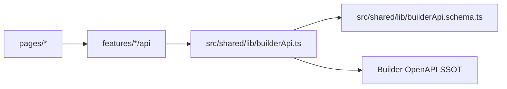

# API 규약 — KPubData Studio

## 1. 역할

Studio는 Builder HTTP API의 소비자입니다. HTTP wire 계약의 단일 소스는 Builder 저장소의 [contract/builder-api.yaml](https://github.com/kpubdata-lab/kpubdata-builder/blob/main/contract/builder-api.yaml)입니다.

이 문서는 endpoint와 response body를 다시 적지 않고, Studio가 Builder 계약을 소비할 때 필요한 클라이언트 경계만 기록합니다.

- Builder endpoint/status/schema 변경은 Builder OpenAPI SSOT에서 시작합니다.
- Studio는 `src/shared/lib/builderApi.ts`와 `src/shared/lib/builderApi.schema.ts`에서 OpenAPI wire shape를 런타임 검증합니다.
- `MIN_BUILDER_API_VERSION`(SemVer 호환성 판정의 기준)과 지원 operation 집합은 `__tests__/contractConformance.test.ts`가 고정합니다.
- 사용자 화면은 page에서 직접 HTTP를 호출하지 않고 feature API를 통해 Builder를 사용합니다.

## 2. Studio 클라이언트 계층

| 계층 | 파일 | 책임 |
| :--- | :--- | :--- |
| 저수준 HTTP 클라이언트 | `src/shared/lib/builderApi.ts` | Builder URL, 인증 헤더, timeout/retry, `ApiError`, 최소 버전/SemVer 호환성 |
| wire schema | `src/shared/lib/builderApi.schema.ts` | Builder JSON 응답 Zod parse |
| BuildSpec 매핑 | `src/features/build-spec/specMapping.ts` | Studio camelCase model ↔ Builder snake_case spec |
| Preview API | `src/features/preview/api/index.ts` | `/preview` 응답을 UI용 rows/schema/warnings로 변환 |
| Validation API | `src/features/validation/api/index.ts` | Builder validation 결과를 폼 오류로 변환 |
| Runs API | `src/features/runs/api/index.ts` | build 실행과 run history 변환 |
| Artifacts API | `src/features/artifacts/api/index.ts` | artifact/manifest 조회 결과 변환 |

## 3. 계약 버전과 정합성

Studio는 `GET /version` 응답의 `api_version`을 `MIN_BUILDER_API_VERSION`과 **SemVer 호환성**
규칙(Builder ADR 0013)으로 비교해 설정 화면에 경고를 표시합니다. exact-equality 비교가
아닙니다.

호환성 규칙 (`isBuilderApiCompatible`):

1. `server major == required major` (major가 다르면 breaking — 비호환).
2. `server >= required` (같은 major 안에서 minor/patch가 최소값 이상).
3. 더 높은 additive minor/patch는 호환으로 간주합니다 (예: 최소값 1.96.0에 대해 Builder
   1.105.0은 호환).
4. 파싱 불가/형식 오류인 버전 문자열은 fail-closed로 비호환 처리합니다.

### Builder 의 enum 은 생성한다 (#793)

Studio 의 응답 스키마(`src/shared/lib/builderApi.schema.ts`)는 손으로 쓴다. 그 안의 enum 값 목록은
Builder 계약에 있는 것을 다시 옮겨 적은 것이었다. 이제 값은 계약에서 생성한다.

| | 어디 | 누가 |
|---|---|---|
| enum 의 값, 그 값을 읽은 계약 버전 | `src/shared/lib/generated/builderEnums.ts` | `scripts/generate-builder-enums.mjs` 가 쓴다. 손으로 고치지 않는다 |
| 스키마의 모양, 어떤 필드가 어떤 enum 인지 | `builderApi.schema.ts` — `builderEnum("BuildJob.status")` | 손으로 |
| **모르는 값이 왔을 때 어떻게 할지** | 그 필드를 선언한 자리 | 손으로 — 생성기가 정하지 않는다 |

`builderApi.schema.ts` 에서 손으로 값을 적는 enum 은 둘만 남는다: `publishErrorCodeSchema` 와
`queryErrorCodeSchema`. 오류의 `code` 는 계약에 스키마의 enum 으로 선언되어 있지 않고 오류 응답의
예시로만 있어서 생성할 것이 없다. 계약에 있는 enum 을 다시 손으로 적으면 `builderEnums.test.ts` 가
실패하고 써야 할 이름을 알려 준다.

enum 의 이름은 계약에서의 위치다: 스키마 자체가 enum 이면 `Schema`, 그 안의 것이면
`Schema.property[.property…]`.

**모르는 enum 값의 처리**는 필드마다 그 필드를 선언한 곳에 드러난다.

- `builderEnum(name)` 그대로 — **엄격**. 스냅샷에 없는 값이 오면 그 응답의 파싱이 실패한다. Studio 가
  그 값으로 무언가를 결정하는 필드(job 의 `status`, stage 의 상태 등)는 이렇게 둔다: 모르는 상태를
  아는 상태 중 하나로 읽는 것보다 실패가 낫다.
- `builderEnum(name).optional().catch(undefined)` — **없는 것으로 읽음**. 그 필드 없이도 화면이 성립하는 경우.
- `z.string()` — **그대로 통과**. Studio 가 값을 해석하지 않고 보여 주기만 하는 경우. `BuildJob.code` 가
  그렇다: 나중에 추가된 사유가 job 전체를 못 읽게 만들면 안 된다(#787).

지금은 `builderApi.schema.ts` 의 한 줄짜리 enum 56개 가운데 32개가 스냅샷에서 온다 — 스키마 이름과
속성 이름이 계약과 그대로 대응하고 값 목록이 같은 것들이다. 나머지 24개는 Studio 쪽 이름이 계약과
다르거나(`KnownWireEncoding`, `StageStatus` 등) 요청 스키마라서 하나씩 대응을 확인해 옮겨야 하고, 아직
손으로 쓴 목록이다. 그것들은 종전처럼 drift 테스트가 계약과 대조한다.

**다시 생성하기**: `BUILDER_CONTRACT=../kpubdata-builder/contract/builder-api.yaml npm run contract:enums`.
Builder 가 enum 값을 더하려면 Studio 가 먼저 그 값을 받아야 한다(Builder 의 CI 가 Studio 의 drift
테스트를 돌린다). 그때는 Builder 의 **브랜치**에 있는 계약으로 생성해서 Studio 에 먼저 넣는다 — 스냅샷이
Builder `main` 보다 앞선 버전을 가리키게 되고, 그것은 허용된다. `contractDrift.test.ts` 는 대조하는 계약의
버전이 스냅샷의 버전과 **같을 때만** 정확히 일치하는지 본다. 버전이 다르면 종전의 규칙 — 계약이 허용하는
값을 Studio 가 모두 받는가 — 만 적용되고, 어느 쪽이 앞서 있는지 로그에 찍는다. 따라서 Builder 가 앞서
나간 뒤 스냅샷이 낡아 있는 것은 실패가 아니다; Studio 가 새 값을 읽어야 할 때 다시 생성한다.

### 애플리케이션 버전 — 짝 판정 (#430)

`api_version` 과 **별개로**, `GET /version` 이 `version`(애플리케이션 릴리스)을 주면
Studio 는 자기 빌드 버전(`package.json` → `import.meta.env.VITE_APP_VERSION`)과 비교합니다.
Builder 와 Studio 는 같은 버전으로 나가므로(kpubdata ADR 0004) 표 없이 한 번의 비교로 끝납니다.

| 차이 | 동작 |
|---|---|
| 같음 | 없음 |
| patch 만 다름 | 조용히 통과, `console.info` 한 줄 |
| minor·major 다름 | 앱 셸 상단 배너 한 줄 — 막지 않는다 |
| `version` 없음·해석 불가·요청 실패 | 없음 — 모르는 것은 다른 것이 아니다 |

계약 버전은 Studio 가 **무엇을 기대해도 되는지**, 애플리케이션 버전은 **같은 릴리스에서
나왔는지** 말합니다. 전자는 기능 판정, 후자는 짝 판정입니다.

`MIN_BUILDER_API_VERSION`(현재 **1.96.0**)은 기억한 값이 아니라 **측정한 값**입니다
(#725, #790). `npm run contract:floor -- --builder-root ../kpubdata-builder` 는 Builder
체크아웃의 `contract/builder-api.yaml` 이력에 있는 계약 버전마다 Studio 의 드리프트 테스트
(`src/shared/lib/contractDrift.test.ts`)를 최신부터 돌리고, 통과하는 가장 오래된 버전을
하한으로 보고합니다. 상수가 하한보다 낮으면 exit 1 입니다. 드리프트 테스트는 두 가지를
봅니다: `builderApi` 가 부르는 모든 method·path 가 그 계약에 선언돼 있는지, 그리고 그
계약이 허용하는 모든 응답을 Studio 스키마가 읽는지.

**필수 — 없으면 화면이 동작하지 않는 것.** 하한을 정하는 것은 라우트입니다. 1.59.0 뒤에
생긴 라우트와 처음 선언된 계약 버전(2026-10-07, Builder `main` 1.105.0 이력에서 측정):

| client 함수 | operation | 최초 계약 |
|---|---|---|
| `getRevision` · `saveRevision` · `getRevisionHistory` · `revertRevision` | `/revisions/{kind}/{doc_id}` … | 1.59.0 |
| `downloadArtifactFile` | `GET /artifacts/{run_id}/{path}` | 1.65.0 |
| `resetPublishReceipt` · `reconcilePublish` | `DELETE /builds/{run_id}/publish/receipt` · `POST …/publish/reconcile` | 1.81.0 |
| `probeProviderKey` | `POST /providers/{provider}/probe` | 1.87.0 |
| `listUploads` | `GET /uploads` | **1.96.0** |

**선택 — 더 오래된 Builder 에서도 화면이 동작하는 것.** 아래는 하한보다 새 계약이 처음
보낸 필드나 처음 선언한 헤더지만, 없을 때의 동작이 정해져 있어 하한을 올리지 않습니다.
여기 넣을 때는 "없을 때" 칸을 코드와 테스트로 확인합니다.

| 기능 | 최초 계약 | 없을 때 |
|---|---|---|
| `GET /providers` 의 `key_provider` (`providerKeys.ts`) | 1.98.0 | 어느 provider 의 키를 쓰는지 모르므로, 필요한 것만 고르지 않고 가진 키를 모두 보낸다 (#770 의 폴백). 요청은 실패하지 않는다 |
| 그 밖에 스키마 주석이 "absent from an older Builder" 로 적은 응답 필드 | 각 주석 | 스키마가 optional 로 받고 화면이 생략한다 |

하한보다 오래된 operation 을 위한 분기(`RUN_LOOKUP_API_VERSION` 1.31.0, #482)는 지원하는
Builder 에서는 더 이상 걸리지 않습니다.

**판정 결과와 안내** (`builderApiCompatibility`) — 해결 방법이 다르므로 이유를 나눕니다.

| 이유 | 조건 | 배너 (`data-version-check`) | 안내 |
|---|---|---|---|
| `too_old` | 같은 major, 하한 미만 | `contract-too-old` | Builder 를 업데이트 |
| `unsupported_major` (Builder 가 더 새 major) | major 가 다름 | `contract-major` | 이 Builder 와 같은 릴리스의 Studio 로 업데이트 |
| `unsupported_major` (Builder 가 더 옛 major) | major 가 다름 | `contract-major` | Builder 를 업데이트 |
| `unreadable` | 버전 없음·`major.minor.patch` 아님 | `contract-unreadable` | Builder 를 업데이트 — fail-closed |

Settings 는 같은 이유로 연결 옆에 한 줄을 보여 줍니다.

정합성 규칙:

1. `MIN_BUILDER_API_VERSION`은 Studio가 실제로 호출·검토한 operation이 요구하는 최소
   버전만 가리킵니다.
2. Builder operation이 추가/삭제되면 Studio 클라이언트 구현과
   `contractConformance.test.ts`를 함께 갱신합니다.
3. 문서만 바꿔서 계약 drift를 덮지 않습니다.

## 4. BuildSpec 매핑 원칙

Studio UI model은 편집 편의상 camelCase를 사용하고, Builder는 YAML/snake_case BuildSpec을 받습니다.

| Studio 관심사 | Builder 관심사 | 원칙 |
| :--- | :--- | :--- |
| `datasetId` | `dataset_id` | 직렬화 경계에서만 변환 |
| `sources[].params` | JSON-compatible params | 문자열로 축소하지 않고 JSON 값을 보존 |
| `sources[].schema` | source schema contract | 편집 왕복에서 손실하지 않음 |
| `exports[].format` | exporter `kind` | Builder catalog/contract 밖의 open kind도 보존 |
| output path | `output_path` / metadata | 명시 경로 우선, 파생 경로는 충돌 없이 생성 |

Builder 데이터 수집/정규화 로직은 Studio에 재구현하지 않습니다. Studio는 기획서 작성, 검증 결과 표시, preview/render 상태 관리만 담당합니다.

## 5. Mock 모드

`VITE_USE_REAL_BUILDER=true`가 아니면 Studio feature API는 결정적 mock 결과를 반환합니다.

mock 정책:

- 화면 개발과 회귀 테스트가 Builder 서버 없이 동작해야 합니다.
- mock은 Builder 로직을 재구현하지 않고 UI 상태를 검증할 만큼의 고정 데이터만 제공합니다.
- 실연동 전용 wire shape는 Zod schema와 API tests로 고정합니다.
- mock/real 분기는 feature API 내부에 머물러야 하며 page 컴포넌트가 직접 환경변수를 해석하지 않습니다.

## 6. 오류 표시 원칙

Studio는 HTTP 실패와 정상 응답 안의 source-level 실패를 구분합니다.

| 상황 | Studio 처리 |
| :--- | :--- |
| 네트워크/인증/비정상 HTTP 실패 | `ApiError` 기반 오류 상태 표시 |
| `/preview` 전체 source 실패 | source key와 error를 포함한 preview 오류 표시 |
| `/preview` 일부 source 실패 | 성공 preview rows/schema와 함께 source warning 표시 |
| 정상 0-row preview | 빈 데이터 안내 표시 |
| `/build` source 실패 | `outcomes[]` 실패 이유를 사용자에게 표시 |

정상 0-row와 source/fetch 실패를 같은 empty state로 합치지 않습니다.

## 7. 관련 문서

| 문서 | 역할 |
| :--- | :--- |
| [Builder OpenAPI SSOT](https://github.com/kpubdata-lab/kpubdata-builder/blob/main/contract/builder-api.yaml) | HTTP wire 계약 단일 소스 |
| [Builder API_CONTRACT.md](https://github.com/kpubdata-lab/kpubdata-builder/blob/main/API_CONTRACT.md) | Builder 운영/정책 가이드 |
| [ARCHITECTURE.md](./ARCHITECTURE.md) | Studio 구조 |
| [STATE_MODEL.md](./STATE_MODEL.md) | UI 상태 흐름 |
| [USER_FLOWS.md](./USER_FLOWS.md) | 사용자 흐름 |
