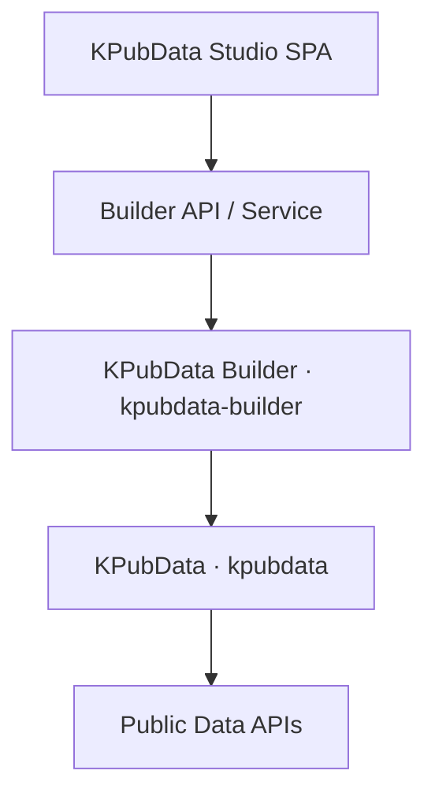
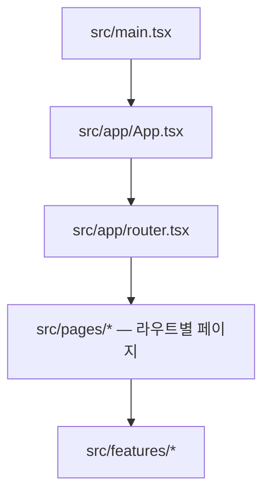
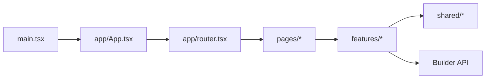
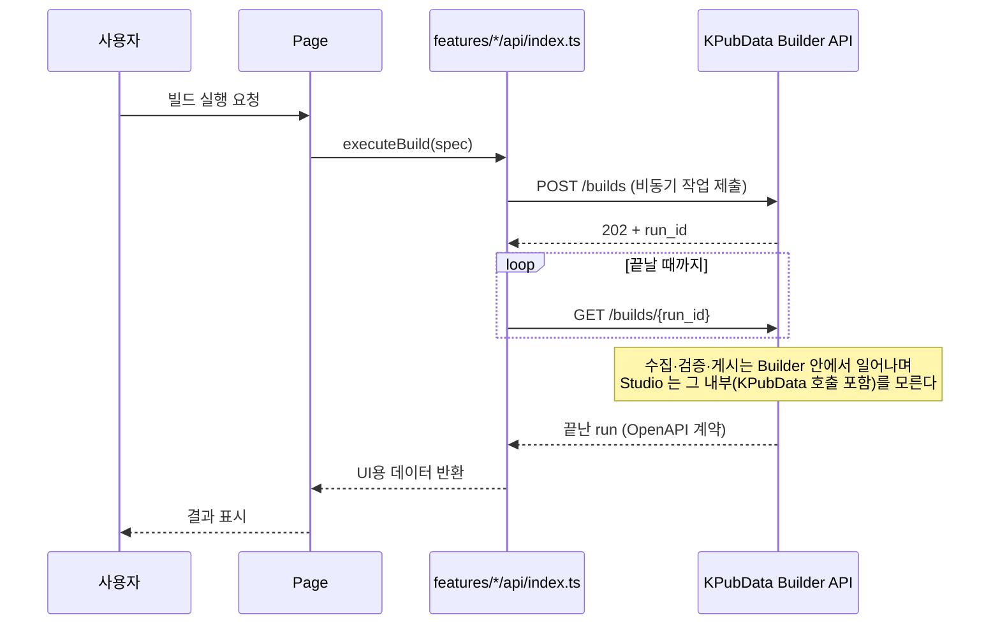
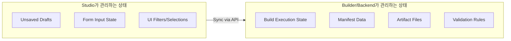

# 아키텍처 — KPubData Studio

## 1. 역할

Studio는 `kpubdata-builder` 위에 놓이는 표현 계층이자 워크플로 계층입니다.



```text
kpubdata-studio
  -> builder API/service
  -> kpubdata-builder
  -> kpubdata
```

### "Studio가 뭔가요?" (초보자용 설명)
KPubData Studio는 복잡한 데이터 수집 과정을 누구나 쉽게 할 수 있도록 도와주는 **작업실**입니다.

- **비유**: "레스토랑 주문 시스템의 터치스크린 키오스크 같은 것입니다. 손님(사용자)이 메뉴(데이터셋)를 고르고, 옵션(파라미터)을 설정하고, 주문(빌드)하면, 주방(Builder)이 요리(아티팩트)를 만듭니다."
- **역할**: 개발자가 아닌 사람도 마우스 클릭 몇 번으로 공공데이터를 수집하고, 정제하고, 파일로 내려받을 수 있는 환경을 제공합니다.

---

## 2. SPA 아키텍처 개요

Studio는 **Vite + React + TypeScript + React Router** 기반의 단일 페이지 애플리케이션(SPA)입니다.

- **Vite**: 빠른 개발 서버와 프로덕션 빌드를 담당합니다.
- **React**: 화면을 컴포넌트 단위로 조립합니다.
- **React Router**: 브라우저 URL과 페이지 컴포넌트를 연결합니다.
- **서버 상태(Builder 응답)**: 공용 캐시 라이브러리를 쓰지 않습니다. 화면·기능마다 `useState` + `useEffect` + `AbortController` 로 만든 훅이 응답을 불러와 자기 상태로 둡니다(예: `features/runs/useBuild.ts`, `features/runs/useBuildJob.ts`, `features/publish/usePublishJob.ts`, `features/data-table/useWarehouseRows.ts`). TanStack Query 는 쓰지 않던 의존성이라 제거했습니다(#82). 공용 클라이언트 계약으로 정리하는 일은 #794 에서 다룹니다.
- **Zustand**: 셸 UI 상태(`shared/hooks/useUIStore.ts`, 테마·사이드바), 메모리에만 두는 로그인 토큰(`features/auth/store.ts`)과 provider 키(`shared/lib/providerKeys.ts`), 어시스턴트 세션, 그리고 세션 단위로 기억하는 서버 사실(버전 확인·관리자 여부·가입 상태·세션 거절)을 담습니다.
- **편집 초안**: Zustand 가 아니라 `localStorage` 에 둡니다(`features/build-spec/draftStorage.ts`, `features/add-data/draftStorage.ts`). 폼 입력은 react-hook-form 이 다룹니다.
- **TypeScript**: Builder API 계약과 UI 상태를 정적으로 검증합니다.



라우트 전체 목록은 [INFORMATION_ARCHITECTURE.md](INFORMATION_ARCHITECTURE.md) 의 URL 표와 `src/app/router.tsx` 에 있습니다.

---

## 3. 아키텍처 원칙

Studio는 빌드 의미론을 소유하지 않습니다.
Studio는 설정, 미리보기, 상태, 결과물을 렌더링합니다.

핵심 원칙:
- 빌드 의미론은 Builder가 소유합니다.
- Studio는 입력, 상태 전이, 시각화, 검토 흐름을 담당합니다.
- 기능별 API 호출은 feature 경계 안에 둡니다.
- 공통 타입과 UI는 `shared/` 에 둡니다(도메인 타입은 `shared/lib/types.ts`, 계약 스키마는 `shared/lib/builderApi.schema.ts`).

---

## 4. 프런트엔드 아키텍처 상세



### 디렉터리 구조 및 가이드

- **`src/main.tsx`**: 브라우저 `#root`에 앱을 마운트하는 진입점입니다.
- **`src/app/`**: 앱 셸과 라우터를 조립합니다.
  - `App.tsx`: `ErrorBoundary` 안에서 `RouterProvider` 연결, 테마 적용
  - `router.tsx`: 브라우저 라우트와 공통 셸(`Layout`) 정의. `/login`·`/signup` 은 셸 밖입니다
- **`src/pages/`**: URL 단위 페이지 컴포넌트를 둡니다(26개). 예:
  - `HomePage.tsx`: `/`
  - `AddDataPage.tsx`: `/add` — 새 테이블 만들기(구성 → 미리보기·검증 → 생성)
  - `BuildsPage.tsx`: `/refresh-jobs`, `/refresh-jobs/:buildId` — 갱신 이력과 run 상세
  - `NewBuildPage.tsx`: `/refresh-jobs/:buildId/edit` — 기존 run 의 spec 을 고쳐 다시 실행
  - `BuildPublishPage.tsx`: `/refresh-jobs/:buildId/publish` — 출판
- **`src/features/`**: 기능 단위로 UI, API, 상태를 묶습니다. 예:
  - `add-data/`: 새 테이블 만들기 흐름
  - `build-spec/`: spec 편집과 초안
  - `preview/`, `validation/`: 미리보기, 검증 결과
  - `runs/`: 실행·취소·재시도·이벤트 추적
  - `artifacts/`: 결과물 조회
  - `publish/`: 출판과 출판 복구
  - `datasets/`, `data-table/`, `sql/`, `discover/`, `quality/`, `monitoring/`, `admin/`, `auth/`, `assistant/`, `reports/` 등
- **`src/shared/`**: 공통 `config`, `content`, `hooks`, `i18n`, `lib`, `ui` 를 둡니다. 도메인 타입은 `shared/lib/types.ts`, Builder 계약 스키마는 `shared/lib/builderApi.schema.ts`, HTTP 클라이언트는 `shared/lib/builderApi.ts` 입니다.

### 기능 폴더 규약

기능 폴더는 아래 패턴을 기본으로 삼습니다.

```text
src/features/<feature>/
├── api/ 또는 api.ts  # Builder 호출과 mock 분기 (있는 feature 만)
├── components/       # 기능 전용 UI
└── use*.ts           # 기능 전용 상태/데이터 훅 (feature 루트에 둠)
```

원칙:
- Builder HTTP 계약은 `shared/lib/builderApi.ts` 하나가 캡슐화합니다(재시도, 타임아웃, 응답 스키마 검증, 오류 표준화). feature 의 `api` 는 그 위에서 mock 모드 분기와 화면용 변환을 맡습니다.
- 지향점은 페이지가 feature 를 조립하고 Builder 호출을 직접 하지 않는 것이지만, 지금은 일부 페이지·컴포넌트가 `builderApi` 를 직접 부릅니다(예: `pages/MonitoringPage.tsx`, `pages/ProviderPage.tsx`, `features/runs/components/CancelRunButton.tsx`). real/demo 클라이언트를 한 인터페이스로 모으는 일은 #794 입니다.
- feature 간 공통 코드는 `shared/` 로 올립니다.

---

## 5. Builder API와의 통신

Studio는 직접 데이터를 수집하지 않고, **Builder API**라는 중간 매개체를 통해 작업을 수행합니다.



### 데이터 흐름
`Studio (SPA)` → `KPubData Builder` HTTP/OpenAPI 계약. Builder 뒤의 KPubData 는 Builder 의 의존성이며 Studio 는 직접 참조하지 않습니다 (Studio → Builder → KPubData).

### API 클라이언트 위치

- Builder API 클라이언트는 Studio 내부의 **연동 표면**입니다.
- 페이지는 feature API를 호출하고, feature API는 Builder의 HTTP 계약을 캡슐화합니다.
- 필드명 변환, 응답 정규화, 에러 표준화는 feature API 또는 shared lib에서 담당합니다.

---

### 실제 Builder 와 데모: 하나의 클라이언트 인터페이스 (#794)

Studio 는 Builder 에 붙어서도, Builder 없이 데모 fixture 로도 돈다. 기능의 API 함수마다
`if (isRealBuilderEnabled()) … else …` 로 둘을 가르면, 두 쪽이 같은 질문에 같은 방식으로 답한다는
것을 아무것도 말해 주지 않는다. 그래서 기능은 **클라이언트 인터페이스 하나**를 두고 구현 둘이 그것을
만족하게 한다.

지금 이 구조인 기능은 **datasets**, **artifacts**, **discover**, **preview**, **add-data** 다
(`src/features/<기능>/api/client.ts`; discover 와 add-data 는 `src/features/<기능>/client.ts`). 아래 표는
datasets 의 이름이고 나머지도 같은 모양이다(`ArtifactsClient`, `DiscoverClient`, `PreviewClient`,
`AddDataClient`).

| | 무엇 |
|---|---|
| `DatasetsClient` | 화면이 기대해도 되는 것: 계약의 응답 모양, 없는 id 에는 `ApiError` 404, 이미 취소된 요청에는 답 없이 거부 |
| `realDatasetsClient` | `builderApi` 를 부른다 |
| `demoDatasetsClient` | fixture 를 읽는다 |
| `datasetsClient()` | 지금 쓸 구현을 고른다. 고르는 곳은 여기 하나다 |
| `api/index.ts` 의 함수들 | `datasetsClient()` 에 묻는다. 화면이 부르는 이름과 인자는 그대로다 |

`client.contract.test.ts` 가 같은 기대를 두 구현에 돌린다. 실제 클라이언트는 **데모의 데이터로 답하는
Builder**(fetch 를 바꿔 끼운 것)에 붙여서, 데모의 답이 JSON 과 계약의 응답 스키마를 거쳐도 그대로인지
본다. 데모가 계약에 없는 필드나 값을 화면에 넘기면 두 답이 달라져 테스트가 실패한다.

데모가 Builder 와 다르게 답하는 곳은 숨기지 않고 그 기능의 `client.ts` 와 계약 테스트에 적는다. artifacts 에는
셋이 있다: 데모는 모르는 run id 에도 답하고, 파일이 없어 다운로드를 거부하며, **끝나지 않은 run 에도
`finished_at` 없는 manifest 를 준다** — Builder 의 계약에는 없는 manifest 다.

add-data 에도 적어 둔 차이가 있다: 데모의 연결 테스트는 언제나 `connected` 이고, 업로드는 파일을 읽지 않고
같은 id 를 주며, **데모의 `GET /catalog` 답이 둘이다** — Add Data 의 것과 Catalog 화면의 것이 서로 다른
fixture 다.

나머지 기능(`publish`, `runs` 등)과 일부 페이지에는 분기가 그대로 있다. 서버 상태의 caching·취소·경쟁 처리 정책은 아직 정하지 않았다 — 이 구조는 그 결정을
전제하지 않는다.

## 6. 주요 프런트엔드 영역

- 홈(데이터셋·최근 run·warehouse 요약)
- 카탈로그와 새 테이블 만들기(`/add`: 구성 → 미리보기·검증 → 생성)
- 테이블 목록·상세, SQL 작업대, 저장된 분석, 리포트
- 빌드 스펙 편집기(기존 run 을 고쳐 다시 실행)
- 갱신 이력과 run 상세(이벤트 타임라인, 취소, 재시도)
- 아티팩트 뷰어
- 출판과 출판 복구
- 품질, 모니터링, 연결(provider 키), 관리

## 7. 백엔드 / 연동 표면

Studio에는 다음을 노출하는 안정적인 연동 계층이 필요합니다.
- 카탈로그·데이터셋 목록 조회
- 소스 미리보기 가져오기, 스펙 검증
- 빌드 제출·상태 조회·취소·이벤트(`POST /builds`, `GET /builds/{id}`, `POST /builds/{id}/cancel`, `GET /builds/{id}/events`)
- manifest 읽기, 아티팩트 목록·파일
- 출판, 출판 준비 상태, 출판 복구(reconcile, receipt 초기화)
- warehouse 테이블·SQL·행·집계·내보내기, 저장된 분석, spec revision
- provider 와 키 확인, 업로드, 품질, 모니터링, 관리

전체 목록은 `src/shared/lib/builderApi.ts` 입니다.

## 8. 상태 소유권



### Studio가 소유하는 상태
- 저장되지 않은 폼/초안 상태
- 로컬 위저드 상태
- UI 필터, 선택 상태, 패널 상태

### 상태 소유권 규칙
- 초안은 `localStorage`(`features/*/draftStorage.ts`), 폼 입력은 react-hook-form, 셸 UI 와 세션 상태는 Zustand 가 소유합니다.
- 서버 상태는 그것을 쓰는 화면의 훅이 불러와 들고 있습니다. 공용 캐시는 없습니다(§2).

### Builder/backend가 소유하는 상태
- 빌드 실행 상태
- manifest 데이터
- 아티팩트 파일 상태
- 검증 의미론

---

## 관련 문서

### 이 저장소 내 문서
| 문서 | 설명 |
| :--- | :--- |
| [STATE_MODEL.md](./STATE_MODEL.md) | 상태 관리 및 전이 모델 |
| [UI_SPEC.md](./UI_SPEC.md) | UI 컴포넌트 규격 |
| [USER_FLOWS.md](./USER_FLOWS.md) | 사용자 시나리오 및 흐름 |
| [INFORMATION_ARCHITECTURE.md](./INFORMATION_ARCHITECTURE.md) | 정보 및 메뉴 구조 |
| [API_CONTRACT.md](./API_CONTRACT.md) | API 통신 규약 |

### KPubData Product Family
| 저장소 | 문서 | 설명 |
| :--- | :--- | :--- |
| **전체 제품군** | [product-family-architecture.md](https://github.com/kpubdata-lab/kpubdata/blob/main/docs/product-family-architecture.md) | **3개 저장소 전체 시스템 아키텍처** |
| [kpubdata](https://github.com/kpubdata-lab/kpubdata) | [ARCHITECTURE.md](https://github.com/kpubdata-lab/kpubdata/blob/main/ARCHITECTURE.md) | KPubData 아키텍처 |
| [kpubdata-builder](https://github.com/kpubdata-lab/kpubdata-builder) | [ARCHITECTURE.md](https://github.com/kpubdata-lab/kpubdata-builder/blob/main/ARCHITECTURE.md) | Builder 아키텍처 |
