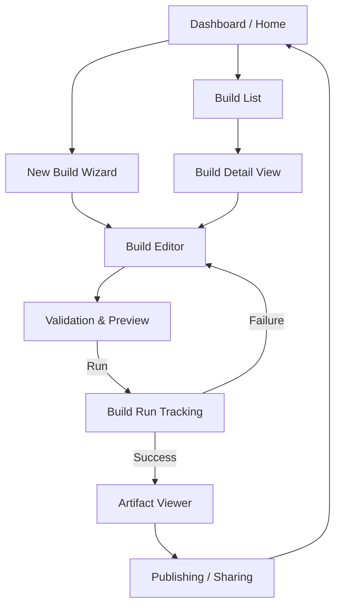
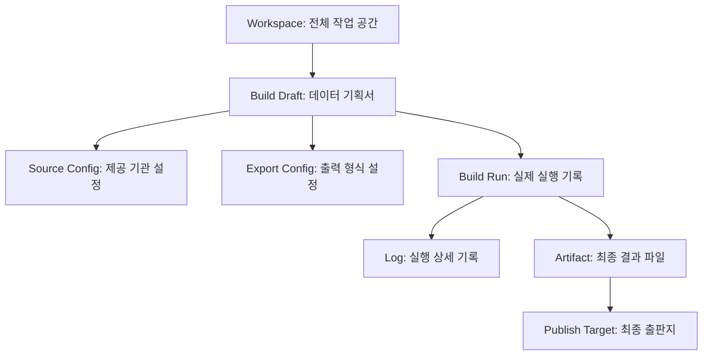

# 정보 구조 — KPubData Studio

## 1. 최상위 섹션

사이드바는 빌드 콘솔(Discover · Add Data · Datasets · Builds · Provider)이 아니라
**데이터를 찾고, 테이블로 두고, 분석하고, 운영하는** 흐름으로 묶는다 (#423). 용어는
kpubdata 의 [TERMINOLOGY.md](https://github.com/yeongseon/kpubdata/blob/main/docs/brand/TERMINOLOGY.md) 를 따른다.

```
KPubData
├── Home                       /
├── DATA
│   ├── Catalog                /discover   공공 API 소스 데이터셋
│   └── Tables                 /tables     소스로 만든 테이블
├── ANALYZE
│   ├── SQL Workspace          /sql        테이블 스냅샷 하나에 SQL
│   ├── Workspace              /workspace
│   └── Reports                /reports
├── OPERATE
│   ├── Refresh Jobs           /refresh-jobs  테이블을 만들고 갱신한 실행
│   ├── Quality                /quality
│   └── Monitoring             /monitoring
├── Connections                /connections
└── Settings                   /settings
```

전역: breadcrumb (topbar) · Ask KPubData · Account

- **옛 URL 은 새 URL 로 redirect 한다.** `/datasets → /tables`, `/builds → /refresh-jobs`,
  `/provider → /connections` — 나머지 경로·쿼리(`?run=`)·해시를 그대로 옮기고 `replace` 로
  히스토리에 남기지 않는다 (`src/app/legacyRedirect.tsx`). 저장해 둔 링크가 끊기지 않는다.
- **테이블 만들기는 메뉴가 아니라 동작이다.** 전역 `New Build` 버튼과 사이드바의
  `Add Data` 를 없앴다. Catalog · Tables 화면의 `Create Table` 이 `/add` 로, Table
  Detail 의 `Refresh` 가 선택한 run 의 스펙 편집(`/refresh-jobs/:id/edit`)으로 간다.
- **SQL Workspace 는 테이블 하나씩** — Engine 의 `/query` 가 run 하나·stage 하나를 읽는다.
  테이블 JOIN 은 kpubdata-builder#704, **Saved Queries 는 서버 저장소(kpubdata-builder#783)가
  생길 때** ANALYZE 에 들어간다. 없는 화면으로 가는 링크는 링크가 없는 것보다 나쁘다.
- **제품명은 한 번만** — 사이드바 로고. topbar 는 보고 있는 대상을 말한다
  (`갱신 작업 / run-1 / 스냅샷 파일`).

---

## 2. 내비게이션 흐름도

사용자가 Studio에서 정보를 찾아가는 흐름입니다.



```text
[Dashboard] 
    |
    +--> [Build List] --(선택)--> [Build Detail]
    |                                |
    +--> [Create New Build] -------->+--> [Editor] --(검증)--> [Preview]
                                                                  |
                                                               (실행)
                                                                  |
                                     [Artifacts] <---(완료)--- [Run Tracking]
                                         |
                                         +--(선택)--> [Publishing]
```

---

## 3. URL 구조

각 화면에 해당하는 브라우저 주소(URL)입니다. 직관적인 구조로 설계되었습니다.

| 경로 | 화면 | 페이지 |
| :--- | :--- | :--- |
| `/` | 홈 | `src/pages/HomePage.tsx` |
| `/discover` | 카탈로그 | `src/pages/DiscoverPage.tsx` |
| `/add` | 테이블 만들기 (Add Data) | `src/pages/AddDataPage.tsx` |
| `/tables` · `/tables/:id` | 테이블 목록 · 상세 | `DatasetCatalogPage` · `DatasetDetailPage` |
| `/refresh-jobs` · `/refresh-jobs/:id[/run\|artifacts\|publish\|edit]` | 갱신 작업 · 실행 상세 | `BuildsPage` 외 |
| `/refresh-jobs/new` | 스펙으로 테이블 만들기 (마법사) | `src/pages/NewBuildPage.tsx` |
| `/sql` | SQL Workspace | `src/pages/SqlWorkspacePage.tsx` |
| `/connections` | 연결 · 활용신청 안내 | `src/pages/ProviderPage.tsx` |
| `/datasets/*` · `/builds/*` · `/provider/*` | 옛 URL → 위 경로로 redirect | `src/app/legacyRedirect.tsx` |

> URL 매핑은 파일 시스템이 아니라 `src/app/router.tsx`의 React Router 설정이 단일 기준입니다.

---

## 4. 객체 계층 구조

Studio 안에서 다루는 모든 정보는 다음과 같은 상하 관계를 가집니다.



- **Workspace (작업실)**: 사용자의 전체 작업 공간
  - **Build Draft (빌드 기획서)**: 데이터 수집 설정 (수정 가능)
    - **Source Config (소스 설정)**: 어떤 기관의 데이터를 가져올지 (기상청, 서울시 등)
    - **Export Config (출력 설정)**: 어떤 파일로 만들지 (Markdown, CSV 등)
  - **Build Run (실행 기록)**: 기획서를 바탕으로 실제로 실행한 결과 (수정 불가)
    - **Log (기록)**: 실행 과정에서 발생한 사건들
    - **Artifact (결과 파일)**: 최종적으로 생성된 데이터 뭉치
  - **Publish Target (출판지)**: 결과물이 최종적으로 도달할 곳 (로컬 파일, 클라우드 등)

---

## 관련 문서

### 이 저장소 내 문서
| 문서 | 설명 |
| :--- | :--- |
| [UI_SPEC.md](./UI_SPEC.md) | UI 컴포넌트 및 화면 명세 |
| [USER_FLOWS.md](./USER_FLOWS.md) | 사용자 시나리오 및 흐름 |
| [ARCHITECTURE.md](./ARCHITECTURE.md) | 시스템 아키텍처 설계 |
| [STATE_MODEL.md](./STATE_MODEL.md) | 상태 관리 모델 |

### KPubData Product Family
| 저장소 | 문서 | 설명 |
| :--- | :--- | :--- |
| [kpubdata](https://github.com/yeongseon/kpubdata) | [ARCHITECTURE.md](https://github.com/yeongseon/kpubdata/blob/main/ARCHITECTURE.md) | Core 아키텍처 |
| [kpubdata-builder](https://github.com/yeongseon/kpubdata-builder) | [ARCHITECTURE.md](https://github.com/yeongseon/kpubdata-builder/blob/main/ARCHITECTURE.md) | Builder 아키텍처 |
