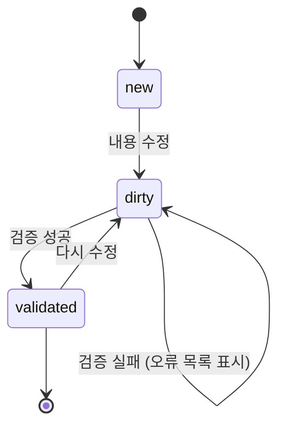
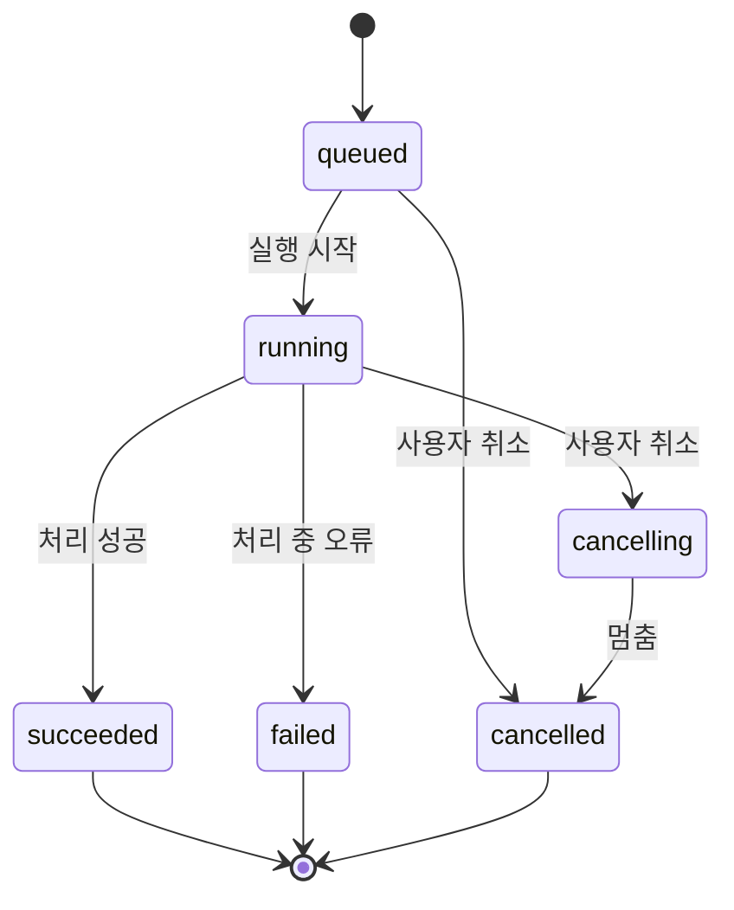
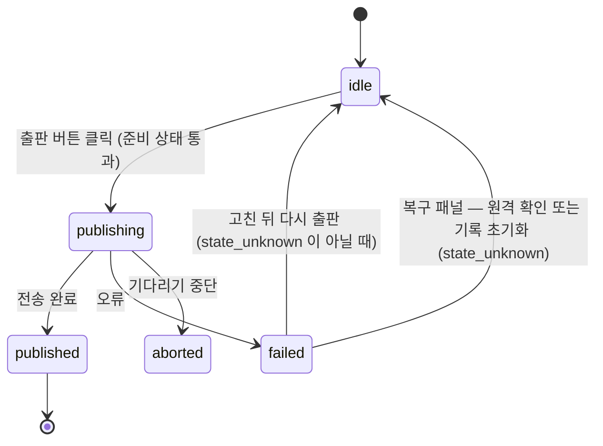
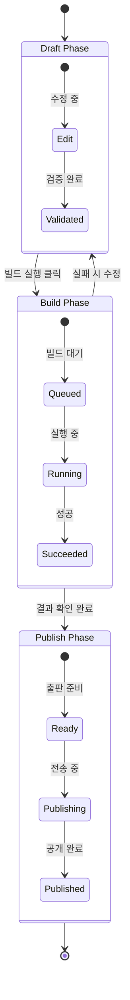
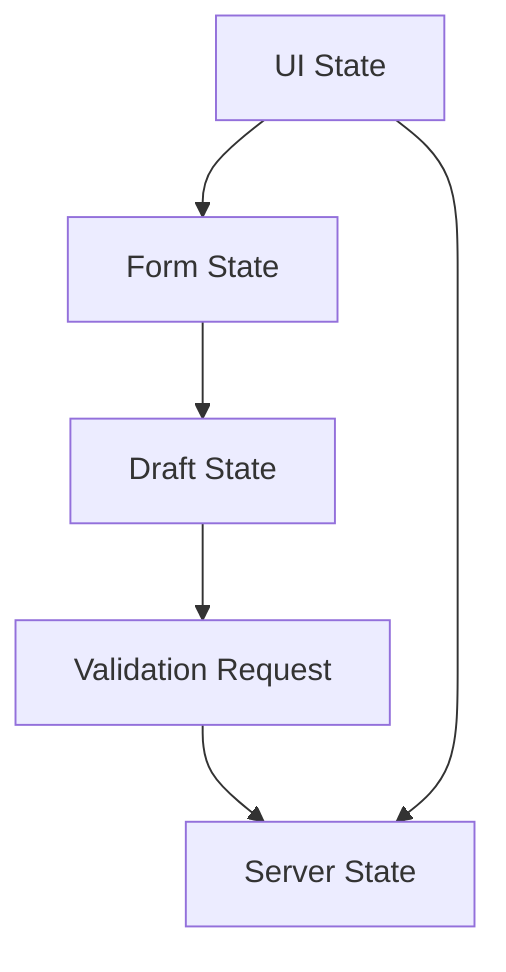

# 상태 모델 — KPubData Studio

## "상태(State)란 무엇인가요?" (초보자용 설명)

상태는 애플리케이션 안의 데이터가 현재 처해 있는 **상황**입니다.

- **비유**: "식당에서 주문하는 과정과 비슷합니다. 메뉴판을 보며 고르는 중(**Draft**) → 주문을 넣음(**Build Run**) → 음식이 서빙됨(**Publish**)"
- 사용자의 행동(클릭, 입력)에 따라 상태가 변하고, 상태가 변하면 화면에 보이는 내용도 달라집니다.

---

## 1. Draft 상태 (편집 중인 상태)

사용자가 빌드 설정을 만들거나 수정하고 있는 임시 저장 단계입니다. 아직 실제로 데이터를 가져오지는 않습니다.

초안은 두 화면에 있습니다.
- **새 테이블 만들기(`/add`)**: 구성 → 미리보기·검증 → 생성의 세 단계. 검증 상태는 `idle` → `validating` → `validated` 입니다(`pages/AddDataPage.tsx`). 초안은 `features/add-data/draftStorage.ts` 가 `localStorage` 에 둡니다.
- **기존 run 의 spec 고치기(`/refresh-jobs/:buildId/edit`)**: 아래 세 상태를 씁니다(`pages/NewBuildPage.tsx`). 초안은 `features/build-spec/draftStorage.ts` 가 둡니다.

### 상태 목록 (spec 편집)
- `new`: 불러온 그대로, 아직 고치지 않은 상태
- `dirty`: 내용이 수정되었지만 아직 검증을 통과하지 않은 상태. 검증이 실패해도 이 상태이며, 오류 목록이 함께 보입니다
- `validated`: 지금 내용이 검증을 통과한 상태

`DraftStatus` 타입(`shared/lib/types.ts`)에는 `invalid` 도 있지만, 지금 화면은 그 값을 만들지 않습니다.

### 상태 전이 흐름

### 사용자의 행동과 UI 반응
- **검증 통과 시**: "실행" 버튼이 활성화됩니다. 통과한 뒤 내용을 고치면 다시 비활성화됩니다.
- **검증 실패 시**: 오류가 목록으로 표시되고, 입력값은 그대로 남습니다.

---

## 2. Build Run 상태 (빌드 실행 중인 상태)

'빌드 실행' 버튼을 눌러 실제로 데이터를 수집하고 파일을 만드는 과정의 상태입니다.

빌드는 비동기 작업입니다. Studio 는 `POST /builds` 로 제출하고 `GET /builds/{run_id}` 를 폴링해 상태를 받습니다. 상태는 Builder 가 정합니다.

### 상태 목록
- `queued`: 대기열에서 차례를 기다리는 중
- `running`: 실제로 데이터를 수집하고 처리하는 중
- `cancelling`: 취소를 요청받아 멈추는 중
- `succeeded`: 모든 데이터 처리가 성공적으로 완료됨
- `failed`: 작업 도중 오류가 발생하여 중단됨
- `cancelled`: 사용자가 작업을 멈춤

### 상태 전이 흐름

### 재시도는 새 run 입니다
끝난 run 은 다시 `queued` 로 돌아가지 않습니다. 재시도는 같은 spec(필요하면 고친 spec)으로 **새 run** 을 제출하는 것이고, 실패하거나 취소된 run 에서 시작하면 요청에 `retry_of` = 이전 run id 를 붙입니다(`features/runs/api/index.ts` `retryOfFor`). 이전 run 은 끝난 상태 그대로 남고, 새 run 상세에는 "재시도 대상:" 과 이전 run 링크가 보입니다. 성공한 run 의 spec 으로 다시 실행하는 것은 갱신이라 `retry_of` 를 붙이지 않습니다.

요청 수준의 재시도는 따로 있습니다. 읽기 요청은 연결 실패·타임아웃·5xx 에 최대 2번 자동으로 다시 보냅니다. 빌드 제출, 취소, 출판처럼 서버에 무언가를 일으키는 요청은 자동으로 다시 보내지 않습니다(`shared/lib/builderApi.ts`).

### 사용자의 행동과 UI 반응
- **실행 중**: 소스별 Bronze/Silver/Gold 단계와 이벤트 타임라인이 보이며, "취소" 버튼을 누를 수 있습니다.
- **성공 시**: 결과 파일 목록과 출판 링크가 보입니다.
- **실패 시**: 어떤 단계에서 오류가 났는지 보이고, spec 을 고쳐 새 run 으로 다시 실행할 수 있습니다.

---

## 3. Publish 상태 (출판/공유 상태)

빌드 완료된 결과물을 다른 사람에게 공유하거나 외부 저장소(예: HuggingFace)로 보내는 단계입니다.

출판 화면은 `/refresh-jobs/:buildId/publish`(`pages/BuildPublishPage.tsx`) 입니다. 지금 대상은 Hugging Face 하나입니다. 출판할 수 있는지는 Builder 가 `GET /builds/{run_id}/publish/readiness` 로 답하고(약관, 데이터 카드, 자격 증명 등), 화면의 출판 작업 상태는 `features/publish/usePublishJob.ts` 가 가집니다.

### 상태 목록
- `idle`: 출판 전. 준비 상태(readiness)가 막힘 사유를 보여 줍니다
- `publishing`: 데이터를 외부로 전송 중
- `published`: 전송이 완료됨. 결과 참조(reference)가 링크로 보입니다
- `failed`: 실패. 실패 종류(`publish_failed`, `publish_conflict`, `publish_in_progress`, `publish_state_unknown` 등)에 따라 안내가 다릅니다
- `aborted`: 사용자가 응답 기다리기를 그만둠. 요청만 끊은 것이라 Builder 의 출판은 계속될 수 있고, 결과는 준비 상태와 출판 기록으로 다시 확인합니다

### 상태 전이 흐름

### 결과를 모를 때 (`publish_state_unknown`)
Builder 가 출판이 갔는지 모르면 다시 보내지 않습니다(두 번 출판될 수 있으므로). 화면은 자동 재시도를 하지 않고, 복구 패널(`features/publish/PublishRecoveryPanel.tsx`)에서 사용자가 고릅니다.
- **원격 확인**(`POST /builds/{run_id}/publish/reconcile`): Builder 가 대상 저장소를 봅니다. 있으면 출판된 것이고, 없으면 기록이 지워져 다시 출판할 수 있습니다.
- **기록 초기화**(`DELETE /builds/{run_id}/publish/receipt`): 보지 않고 기록만 지웁니다. 두 번 확인을 받습니다.

`shared/lib/types.ts` 의 `PublishStatus`(`not_started`/`ready`/…)는 예전 설계의 이름이며 지금 화면은 쓰지 않습니다.

---

## 4. 전체 생명주기

Draft부터 시작하여 Build Run을 거쳐 Publish까지 이르는 전체 흐름입니다.

---

## 5. 상태 분리 원칙 (Form / Server / UI / Draft)

Studio는 한 화면에서 여러 종류의 상태를 동시에 다룹니다. 서로 다른 책임을 섞지 않기 위해 아래처럼 분리합니다.

| 상태 종류 | 소유 위치 | 예시 | 원칙 |
| :--- | :--- | :--- | :--- |
| **Form State** | 페이지/기능 폼 | 입력 중인 provider, dataset, params | 사용자가 타이핑하는 즉시 변하는 값 |
| **Draft State** | Studio 로컬 초안 | 아직 저장되지 않은 빌드 기획 전체 | 여러 Form State를 모아 편집 세션으로 유지 |
| **Server State** | Builder API 응답 | preview 결과, 빌드 outcomes, manifest, artifacts 목록 | 네트워크로부터 동기화되며 서버가 기준 |
| **UI State** | 화면 제어 상태 | 선택된 탭, 필터, 모달 열림 여부, 정렬 기준 | 표현 방식만 결정하며 도메인 의미를 소유하지 않음 |

### 분리 규칙
- Form State는 입력 컴포넌트와 가장 가깝게 둡니다.
- Draft State는 페이지 이동이나 단계 전환에도 유지되어야 하는 편집 세션입니다.
- Server State는 그것을 쓰는 화면·기능의 훅이 불러와 들고 있습니다(`useState` + `useEffect` + `AbortController`). 공용 캐시는 없습니다.
- UI State는 탭, 필터, 펼침 상태처럼 화면 표현 전용 값만 담습니다. 셸 전체의 UI 상태(테마, 사이드바)는 Zustand(`shared/hooks/useUIStore.ts`)에 둡니다.
- Form State는 react-hook-form, Draft State는 `localStorage`(`features/*/draftStorage.ts`)에 둡니다.

### 왜 분리하나요?
- 검증 실패가 곧바로 사용자의 입력값 자체를 덮어쓰지 않게 하기 위해
- 서버 응답 지연이 로컬 편집 경험을 망치지 않게 하기 위해
- 같은 Draft를 여러 화면 패널이 공유하되, 각 패널의 UI 상태는 독립적으로 유지하기 위해

---

## 6. "상태와 UI의 관계" 요약

상태는 사용자가 지금 무엇을 해야 하는지, 무엇을 할 수 있는지를 결정하는 **지침**이 됩니다.

| 현재 상태 | UI에서 보여줄 모습 | 가능한 주요 버튼 |
| :--- | :--- | :--- |
| `dirty` | 검증을 통과하지 않은 변경, 실패했다면 오류 목록 | [검증] |
| `validated` | 검증 통과 | [실행] |
| `running` | 소스별 Bronze/Silver/Gold 단계와 이벤트 타임라인 | [취소] |
| `succeeded` | 결과 파일 목록 | [결과물], [출판] |
| `failed` | 실패 단계와 원인 | spec 을 고쳐 새 run 으로 실행 (`retry_of`) |
| `published` | 출판 결과 참조를 링크로 표시 | — |

---

## 관련 문서

### 이 저장소 내 문서
| 문서 | 설명 |
| :--- | :--- |
| [ARCHITECTURE.md](./ARCHITECTURE.md) | 시스템 아키텍처 설계 |
| [UI_SPEC.md](./UI_SPEC.md) | UI 컴포넌트 규격 |
| [USER_FLOWS.md](./USER_FLOWS.md) | 사용자 시나리오 및 흐름 |
| [API_CONTRACT.md](./API_CONTRACT.md) | API 통신 규약 |

### KPubData Product Family
| 저장소 | 문서 | 설명 |
| :--- | :--- | :--- |
| [kpubdata](https://github.com/kpubdata-lab/kpubdata) | [ARCHITECTURE.md](https://github.com/kpubdata-lab/kpubdata/blob/main/ARCHITECTURE.md) | KPubData 아키텍처 |
| [kpubdata-builder](https://github.com/kpubdata-lab/kpubdata-builder) | [ARCHITECTURE.md](https://github.com/kpubdata-lab/kpubdata-builder/blob/main/ARCHITECTURE.md) | Builder 아키텍처 |
