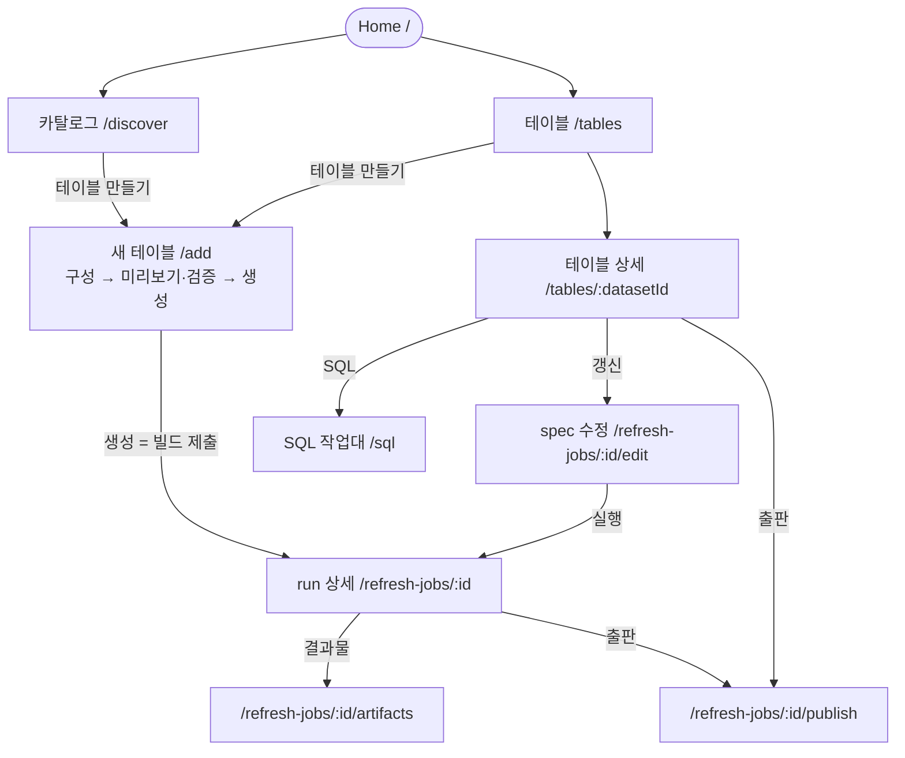

# UI 명세 — KPubData Studio

## 1. 화면 내비게이션 흐름

화면과 URL 의 전체 목록은 [INFORMATION_ARCHITECTURE.md](./INFORMATION_ARCHITECTURE.md) 에 있고, 기준은 `src/app/router.tsx` 입니다. 아래는 테이블을 만들고 갱신·출판하는 중심 흐름입니다.

## 2. 주요 화면

### [Home] `/`
처음 쓰는 사람에게는 시작 안내를, 데이터가 있는 사람에게는 현황을 보여 줍니다(`pages/HomePage.tsx`).
- **API**: `GET /datasets`, `GET /builds`, warehouse 가 있으면 `GET /warehouse/tables`, 최근 스냅샷, `GET /analyses`.
- 데이터셋도 run 도 없으면 시작 화면(StartHome)이 나옵니다.
- 전역 "New Build" 버튼은 없습니다. 테이블 만들기는 카탈로그·테이블 화면에서 `/add` 로 갑니다.

### [새 테이블 만들기] `/add`
테이블 하나를 만드는 단일 흐름입니다(`pages/AddDataPage.tsx`). 세 단계입니다.
1. **구성**: 데이터셋, provider 키, 요청 파라미터, 활용신청 안내.
2. **미리보기·검증**: `POST /preview`, `POST /validate`. Builder 미리보기가 테이블의 논리 이름을 알려 줍니다.
3. **생성**: 빌드를 `POST /builds` 로 제출하고 진행을 폴링합니다.

초안은 `localStorage` 에 남아, 다시 들어오면 이어서 할 수 있습니다. `/refresh-jobs/new` 는 쿼리를 유지한 채 여기로 이동합니다(작업대에 저장한 spec, Ask KPubData 초안).

### [spec 수정] `/refresh-jobs/:buildId/edit`
이미 있는 run 의 spec 을 고쳐 다시 실행합니다(`pages/NewBuildPage.tsx`).
- 소스(provider·데이터셋·파라미터)와 내보내기 형식을 고칩니다. 내보내기는 형식만 고르며, 저장 위치를 고르는 항목은 없습니다.
- `[검증]` 은 `POST /validate`, 미리보기는 `POST /preview` 입니다. `[실행]` 은 검증을 통과한 뒤에만 켜지고, 통과한 뒤 내용을 고치면 다시 꺼집니다.
- 실행은 새 run 을 `POST /builds` 로 제출합니다. 원래 run 이 실패하거나 취소된 것이면 `retry_of` 로 그 run 을 가리킵니다([STATE_MODEL.md](./STATE_MODEL.md) §2).
- provider 목록은 `GET /catalog` 에서 옵니다.

### [갱신 이력과 run 상세] `/refresh-jobs`, `/refresh-jobs/:buildId`
- 목록은 `GET /builds`, 상세는 `GET /builds/{run_id}` 를 폴링합니다.
- 실행 중에는 소스별 Bronze/Silver/Gold 단계와 이벤트 타임라인(`GET /builds/{run_id}/events`)이 보입니다. 진행률 막대는 없습니다.
- `[취소]` 는 `POST /builds/{run_id}/cancel` 입니다. 실행 중인 run 은 `cancelling` 을 거쳐 `cancelled` 가 됩니다.
- 끝난 run 에서 결과물·출판·spec 수정으로 갑니다.

### [결과물] `/refresh-jobs/:buildId/artifacts`
`GET /builds/{run_id}/manifest` 와 `GET /artifacts/{run_id}` 로 결과 파일을 보여 주고 내려받게 합니다.

### [출판] `/refresh-jobs/:buildId/publish`
빌드 결과를 Hugging Face 로 출판합니다(`pages/BuildPublishPage.tsx`).
- 데이터 카드 미리보기, 준비 상태(`GET /builds/{run_id}/publish/readiness`: 약관, 데이터 카드, 자격 증명).
- 대상 저장소(`owner/repo`), 비공개·공개 선택, 비상업 약관이면 확인. Hugging Face 토큰은 필요한 배포에서만 `X-Publish-Credential` 헤더로 한 번 보냅니다.
- `[출판]` 은 `POST /builds/{run_id}/publish` 이고, 성공하면 결과 참조가 링크로 보입니다.
- 결과를 모르는 실패(`publish_state_unknown`)에는 자동 재시도 대신 복구 패널이 나옵니다(원격 확인 `POST …/publish/reconcile`, 기록 초기화 `DELETE …/publish/receipt`).
- 런 상세, 결과물 화면, 테이블 상세에서 들어옵니다.

## 3. 화면별 API 호출 지도

| 화면 | 호출 API |
| :--- | :--- |
| Home | `GET /datasets`, `GET /builds`, `GET /warehouse/tables`, `GET /analyses` |
| 카탈로그 `/discover` | `GET /catalog`, `GET /datasets` |
| 새 테이블 `/add` | `POST /preview`, `POST /validate`, `POST /builds`, `GET /builds/{id}` |
| spec 수정 | `GET /catalog`, `POST /validate`, `POST /preview`, `POST /builds` |
| 갱신 이력·run 상세 | `GET /builds`, `GET /builds/{id}`, `GET /builds/{id}/events`, `POST /builds/{id}/cancel` |
| 결과물 | `GET /builds/{id}/manifest`, `GET /artifacts/{id}`, `GET /artifacts/{id}/{file}` |
| 출판 | `GET /builds/{id}/publish/readiness`, `POST /builds/{id}/publish`, `POST …/publish/reconcile`, `DELETE …/publish/receipt` |
| 테이블·SQL·저장된 분석 | `GET /warehouse/tables…`, `POST /warehouse/query`, `/rows`, `/aggregate`, `/exports`, `GET /analyses…` |
| 품질 / 모니터링 | `GET /quality/…` / `GET /monitoring/…` |
| 연결 `/connections` | `GET /providers`, provider 키 확인 |
| 관리 `/admin` | `GET /admin/…` (관리자만) |
| 설정 | `GET /version` |

> 각 화면은 `src/pages/` 에서 조립됩니다. Builder 호출은 `shared/lib/builderApi.ts` 가 캡슐화하고, feature 의 `api` 가 그 위에서 mock 모드를 나눕니다. 일부 페이지는 `builderApi` 를 직접 부릅니다([ARCHITECTURE.md](./ARCHITECTURE.md) §4). 데모(GitHub Pages)는 Builder 없이 mock 데이터로 같은 화면을 보여 줍니다.

## 4. 에러 및 예외 상태 처리

- **Loading State**: 데이터를 불러오는 동안 스피너나 스켈레톤 UI 를 보여 줍니다.
- **Empty State**: 목록이 비면 다음 행동을 안내합니다(예: Home 의 시작 화면).
- **Error State**:
  - **Network Error**: 읽기 요청은 연결 실패·타임아웃·5xx 에 최대 2번 자동으로 다시 시도한 뒤 "Builder API에 연결하지 못했습니다." 또는 "Builder API 응답이 시간 내에 오지 않았습니다." 를 보여 줍니다. 빌드 제출·취소·출판은 자동으로 다시 보내지 않습니다.
  - **Validation Error**: 검증 오류를 목록으로 보여 주고, 입력값은 그대로 둡니다.

---

## 관련 문서

### 이 저장소 내 문서
| 문서 | 설명 |
| :--- | :--- |
| [ARCHITECTURE.md](./ARCHITECTURE.md) | 시스템 아키텍처 설계 |
| [STATE_MODEL.md](./STATE_MODEL.md) | 상태 관리 모델 |
| [USER_FLOWS.md](./USER_FLOWS.md) | 사용자 흐름도 |
| [INFORMATION_ARCHITECTURE.md](./INFORMATION_ARCHITECTURE.md) | 정보 구조 설계 |

### KPubData Product Family
| 저장소 | 문서 | 설명 |
| :--- | :--- | :--- |
| [kpubdata](https://github.com/kpubdata-lab/kpubdata) | [ARCHITECTURE.md](https://github.com/kpubdata-lab/kpubdata/blob/main/ARCHITECTURE.md) | KPubData 아키텍처 |
| [kpubdata-builder](https://github.com/kpubdata-lab/kpubdata-builder) | [ARCHITECTURE.md](https://github.com/kpubdata-lab/kpubdata-builder/blob/main/ARCHITECTURE.md) | Builder 아키텍처 |
