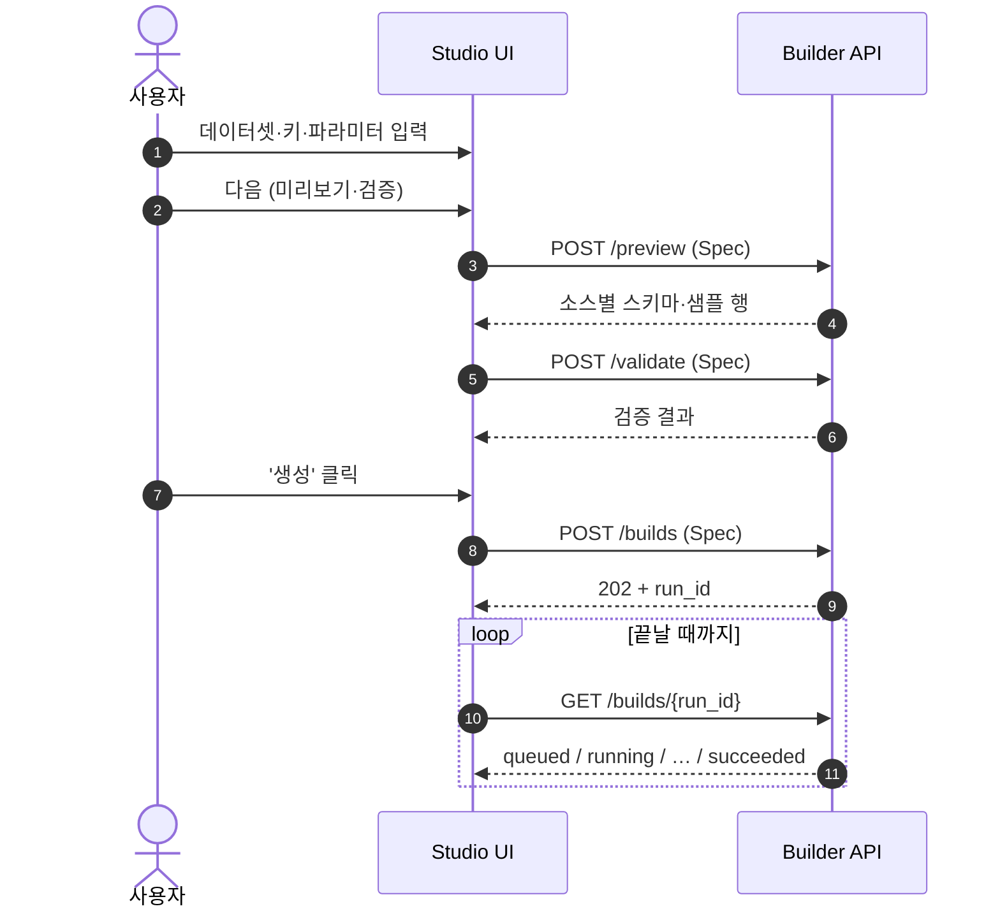
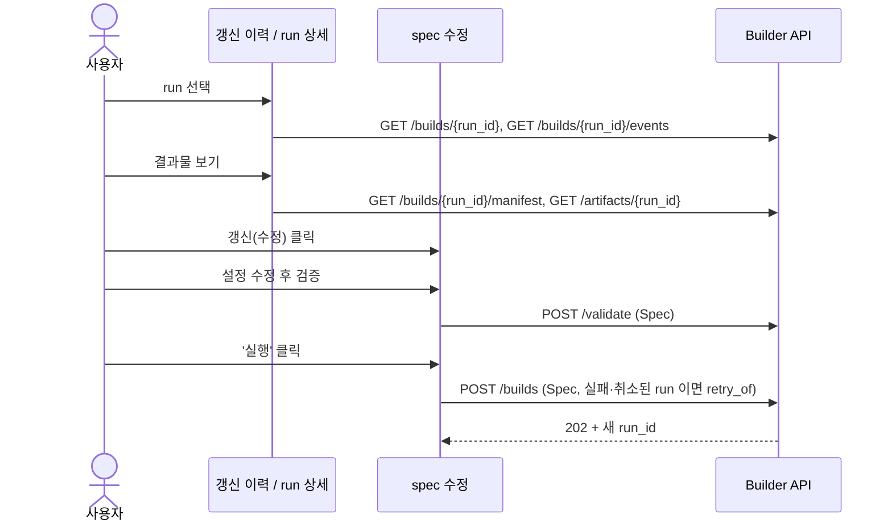
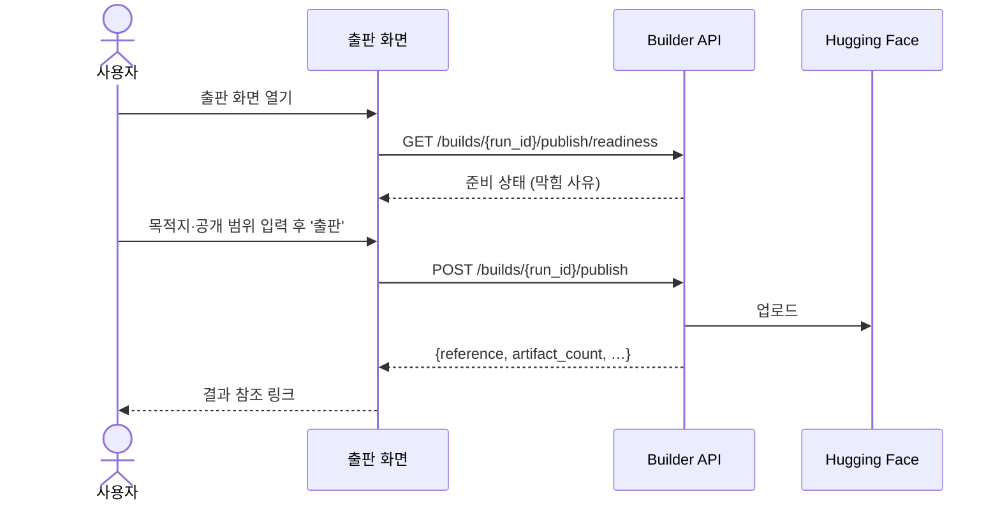
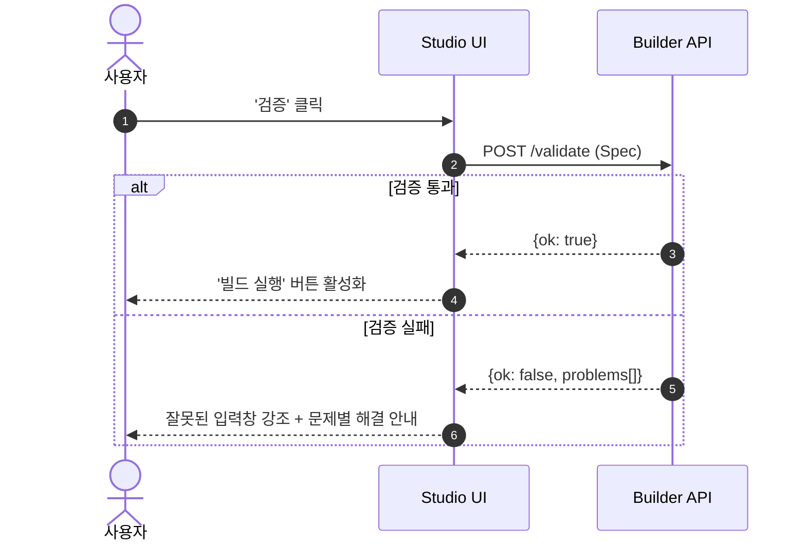
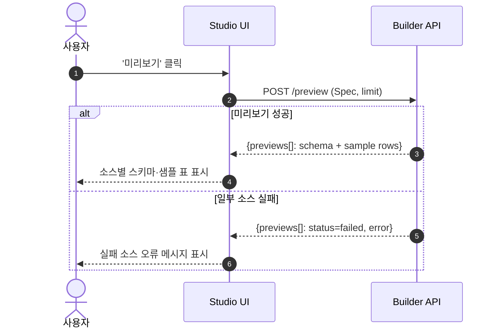
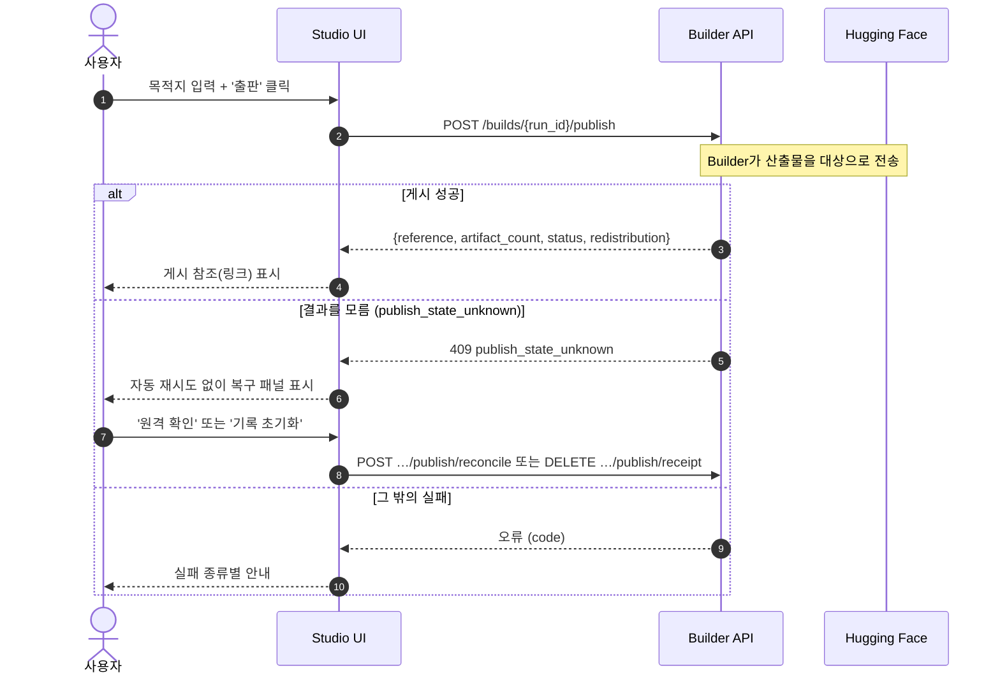
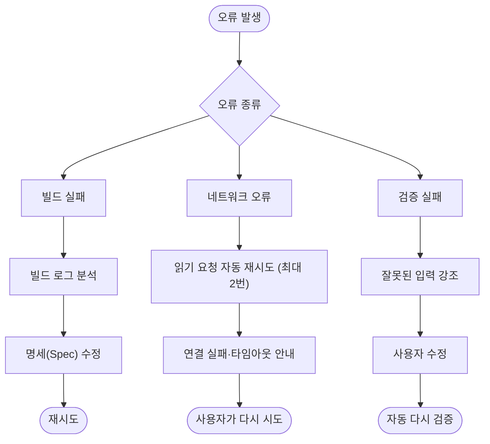

# 사용자 흐름 · 기능처리도 — KPubData Studio

> 이 문서는 KPubData Studio의 **기능처리도(機能處理圖)**를 겸합니다. 앞부분(§1~§3)은 사용자 여정(journey) 관점의 흐름을, [§4 기능별 처리 흐름](#4)은 검증·미리보기·출판 각 **기능 단위**의 요청/응답 처리 시퀀스를 정리합니다. Builder API 계약은 [API_CONTRACT.md](./API_CONTRACT.md)를 참고하세요.

> **참고**
>
> - 주요 화면의 스크린샷은 [화면 스크린샷](screenshots.md) 페이지에서 확인할 수 있습니다.
> - 각 화면(페이지)의 상세 설계는 [화면 설계서](screens/index.md)에서 페이지 단위로 확인할 수 있습니다.

## 0. 화면 라우트 맵

실제 배포된 화면(라우트)과 사용자 흐름의 대응 관계입니다. 라우트 전체는 [INFORMATION_ARCHITECTURE.md](./INFORMATION_ARCHITECTURE.md) 의 URL 표와 `src/app/router.tsx` 에 있습니다. 화면 설계서(`screens/`)는 예전 `/builds…` 경로 이름으로 되어 있으며, 해당 경로는 지금 `/refresh-jobs…` 로 이동합니다.

| 흐름 | 주요 화면(라우트) | 화면 설계서 |
| :--- | :--- | :--- |
| 진입/현황 파악 | 홈 `/` | [dashboard](screens/dashboard.md) |
| 테이블 만들기 | 카탈로그 `/discover` 또는 테이블 `/tables` → 새 테이블 `/add` | [new-build](screens/new-build.md) |
| 갱신·재실행 | 갱신 이력 `/refresh-jobs` → run 상세 `/refresh-jobs/:buildId` → spec 수정 `/refresh-jobs/:buildId/edit` | [builds](screens/builds.md) · [build-detail](screens/build-detail.md) · [build-edit](screens/build-edit.md) |
| 실행 추적 | 실행 `/refresh-jobs/:buildId/run` | [build-run](screens/build-run.md) |
| 결과물 확인 | 결과물 `/refresh-jobs/:buildId/artifacts` | [build-artifacts](screens/build-artifacts.md) |
| 출판 | 출판 `/refresh-jobs/:buildId/publish` | [build-publish](screens/build-publish.md) |
| 환경설정 | 설정 `/settings` | [settings](screens/settings.md) |

> 현재 배포본(GitHub Pages)은 **MOCK 모드**로 동작하며, 화면 데이터는 데모 시드 데이터(`src/shared/lib/demoDatasets.ts`)에서 제공됩니다. `/validate`·`/preview`·`/artifacts`는 `/add` 나 run 선택으로 안내하는 레거시 진입점입니다. `/builds…`·`/datasets…`·`/provider…` 는 새 경로로 이동합니다(`/builds/new` 는 `/refresh-jobs/new` 를 거쳐 `/add`).

---

## 1. 테이블 만들기 (`/add`)
데이터를 골라 첫 테이블을 만들기까지의 과정입니다. 카탈로그나 테이블 화면의 "테이블 만들기"에서 시작합니다.

### 상세 단계
1. **구성**: 데이터셋을 고르고, 필요하면 provider 키와 요청 파라미터(날짜, 지역 등)를 넣습니다. 활용신청이 필요한 데이터셋이면 안내가 나옵니다.
2. **미리보기·검증**: 실제 데이터가 어떤 모양으로 들어오는지 표로 보고, 설정 전체를 검증합니다. Builder 가 만들어질 테이블의 이름을 알려 줍니다.
3. **생성**: 빌드를 제출하고 진행을 지켜봅니다.

### 사용자가 경험하는 시나리오 예시
- **하는 일**: "서울 아파트 실거래가를 이번 달 기준으로 테이블로 만들고 싶어."
- **시스템 반응**: 필요한 파라미터를 안내하고, 샘플 데이터를 보여 준 뒤, 빌드가 끝나면 테이블 상세와 결과물로 이어집니다.

---

## 2. 기존 테이블 갱신과 재실행
과거에 했던 작업을 다시 확인하거나 조금 수정해서 다시 실행하는 과정입니다.

### 상세 단계
1. **run 선택**: 갱신 이력(`/refresh-jobs`)이나 테이블 상세에서 run 을 고릅니다.
2. **상세 확인**: 상태, 소스별 단계, 이벤트 타임라인, 사용한 spec 을 봅니다.
3. **결과 파일 확인**: 결과물 화면에서 manifest 와 파일을 보고 내려받습니다.
4. **고쳐서 다시 실행**: spec 수정 화면에서 설정을 바꾸고(예: 날짜만 오늘로), 검증한 뒤 실행합니다. 새 run 이 만들어지며, 원래 run 이 실패하거나 취소된 것이었으면 `retry_of` 로 그 run 을 가리킵니다.

mock 모드(데모)에서는 manifest 와 파일 목록도 mock 데이터에서 옵니다.

---

## 3. 출판
완성된 데이터를 Hugging Face 에 내놓는 단계입니다.

### 상세 단계
1. **성공한 run 선택**: run 상세, 결과물 화면 또는 테이블 상세의 "출판"으로 들어갑니다.
2. **데이터 카드와 준비 상태 확인**: 제목, 설명, 라이선스, 출처 표기가 담긴 데이터 카드를 보고, Builder 가 알려 주는 준비 상태(약관, 카드, 자격 증명)를 확인합니다.
3. **목적지 확인**: Hugging Face 저장소(`owner/repo`)와 비공개·공개를 정합니다. 비상업 약관이면 확인을 받습니다.
4. **출판 실행**: '출판' 버튼을 누르면 Builder 가 보내고, 결과 참조가 링크로 보입니다.

---

## 4. 기능별 처리 흐름 (기능처리도)

사용자 여정과 무관하게, 핵심 기능 각각이 Studio UI→Builder API로 어떻게 요청/응답을 처리하는지 **기능 단위**로 분리해 정리합니다. 서비스 구현과 계약은 Builder가 소유하며(Studio는 요청만 함), 상세 계약은 [API_CONTRACT.md](./API_CONTRACT.md)를 따릅니다.

### 4.1 검증 (validate)

명세(Spec)가 실행 가능한지 Builder에 확인을 요청합니다. 네트워크 수집 없이 명세만 검사합니다.

### 4.2 미리보기 (preview)

산출물 파일을 기록하지 않고, 각 소스의 스키마와 샘플 행만 Builder에서 받아 표로 보여줍니다.

### 4.3 출판 (publish)

성공한 빌드의 산출물을 Hugging Face 로 게시합니다. Studio 는 요청만 하고 실행은 Builder 가 수행합니다.

---

## 5. 에러 시나리오

### 빌드 실패
- **발생 원인**: 공공데이터 API 서버 장애, 혹은 잘못된 파라미터 값 입력.
- **사용자 경험**: 빌드 상태가 `failed`로 변하며 붉은색 경고 메시지가 보입니다.
- **시스템 대처**: "API 서버 응답이 없습니다. 잠시 후 다시 시도해주세요." 같은 구체적인 실패 원인 로그를 보여줍니다.

### 네트워크 오류
- **발생 원인**: 사용자의 인터넷 연결 끊김 혹은 Studio 서버 다운.
- **사용자 경험**: 해당 영역에 "Builder API에 연결하지 못했습니다." 또는 "Builder API 응답이 시간 내에 오지 않았습니다." 가 보입니다.
- **시스템 대처**: 읽기 요청은 최대 2번 자동으로 다시 시도한 뒤 오류를 보여 줍니다. 빌드 제출·취소·출판은 두 번 일어나지 않도록 자동으로 다시 보내지 않습니다. 오프라인 감지나 자동 재연결은 없습니다.

### 검증 실패
- **발생 원인**: 필수 입력값 누락, 혹은 형식에 어긋난 입력(예: 숫자 자리에 문자 입력).
- **사용자 경험**: '빌드 실행' 버튼이 비활성화되고, 잘못된 입력창 주위에 붉은색 테두리가 생깁니다.
- **시스템 대처**: "날짜는 YYYYMMDD 형식을 지켜주세요" 등 해결 방법을 직접 제안합니다.

---

## 6. 에러 복구 흐름

---

## 관련 문서

### 이 저장소 내 문서
| 문서 | 설명 |
| :--- | :--- |
| [UI_SPEC.md](./UI_SPEC.md) | UI 컴포넌트 및 화면 명세 |
| [화면 설계서](screens/index.md) | 페이지(라우트) 단위 화면 설계서 모음 |
| [STATE_MODEL.md](./STATE_MODEL.md) | 상태 관리 모델 |
| [INFORMATION_ARCHITECTURE.md](./INFORMATION_ARCHITECTURE.md) | 정보 및 메뉴 구조 |
| [ARCHITECTURE.md](./ARCHITECTURE.md) | 시스템 아키텍처 설계 |

### KPubData Product Family
| 저장소 | 문서 | 설명 |
| :--- | :--- | :--- |
| [kpubdata](https://github.com/kpubdata-lab/kpubdata) | [ARCHITECTURE.md](https://github.com/kpubdata-lab/kpubdata/blob/main/ARCHITECTURE.md) | KPubData 아키텍처 |
| [kpubdata-builder](https://github.com/kpubdata-lab/kpubdata-builder) | [ARCHITECTURE.md](https://github.com/kpubdata-lab/kpubdata-builder/blob/main/ARCHITECTURE.md) | Builder 아키텍처 |
