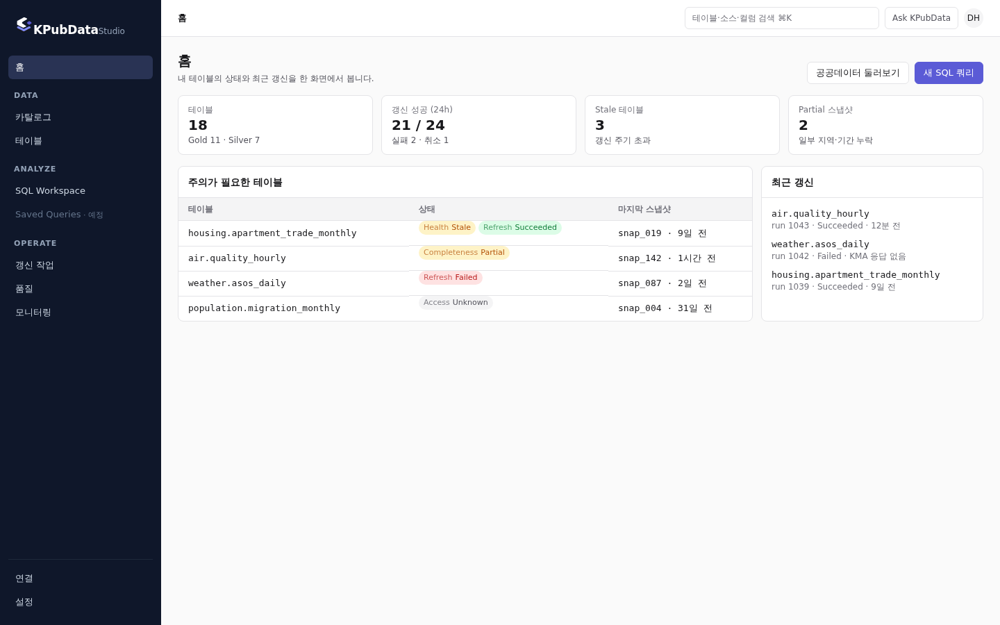
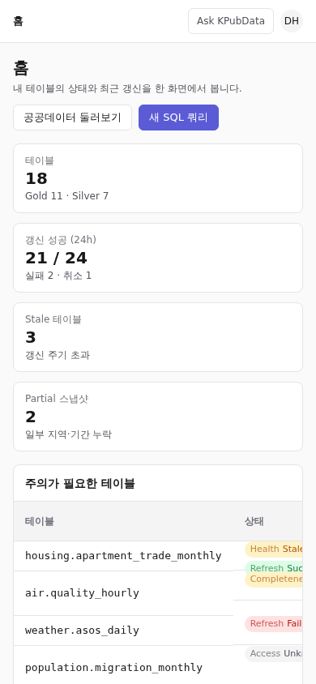
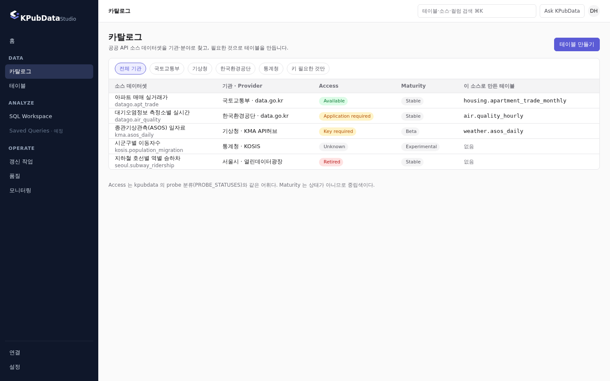
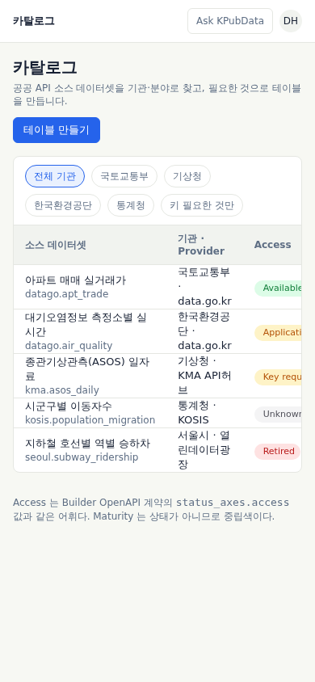
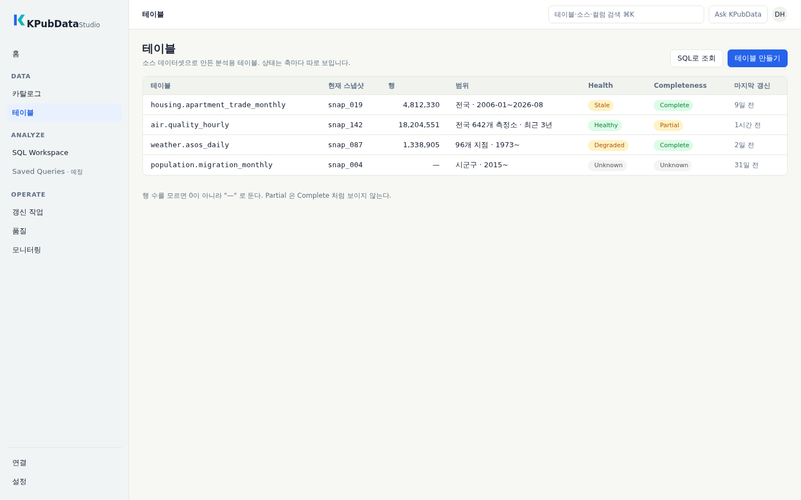
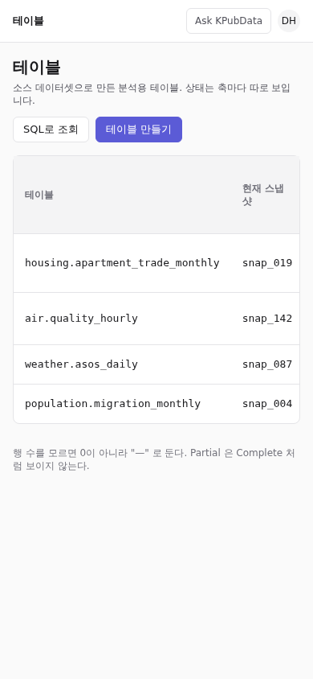
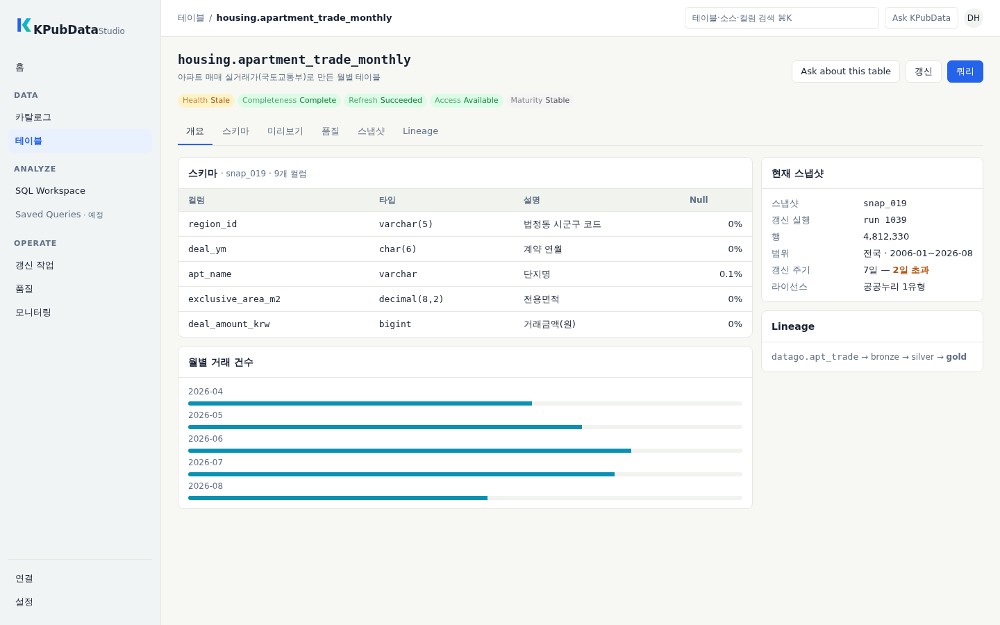
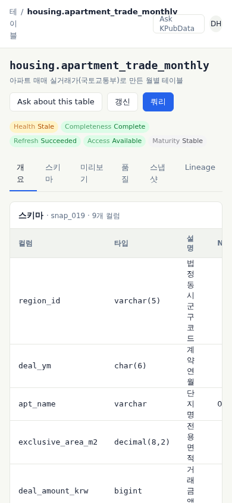
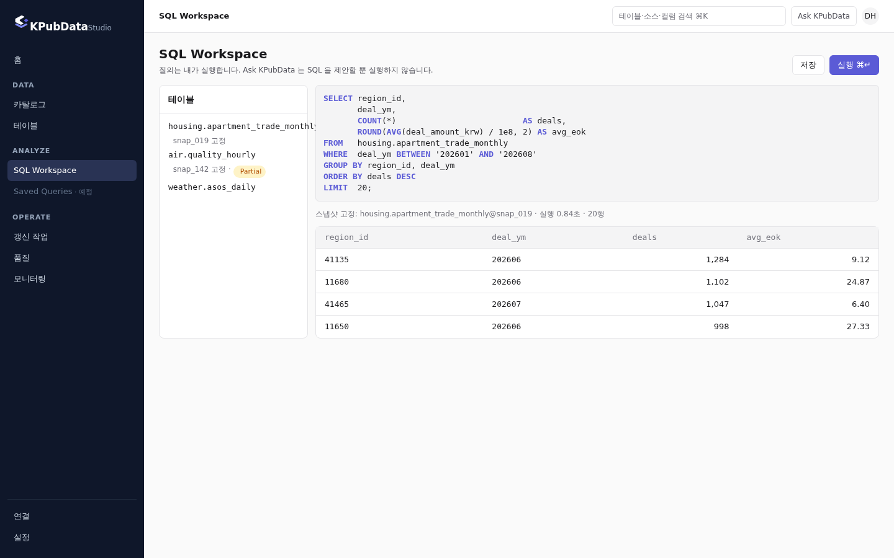
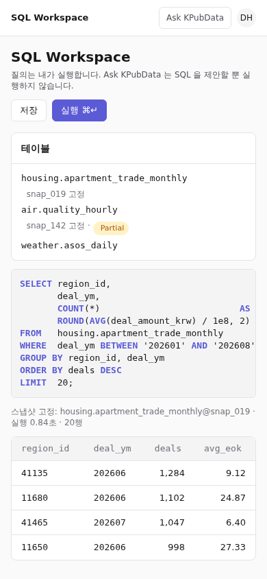

# 시각 정체성 (Visual Identity)

> 이 문서는 KPubData 화면이 따르는 시각 규칙의 **canonical spec** 이다 (Brand v2, #628 — #425 를
> 개정). 정확히 **무엇을** 쓰는지 — 색 값 · token · 크기 · 금지 사항 — 만 정한다.
>
> - **왜** 이렇게 하는지는 [디자인 컨셉](DESIGN_CONCEPT.md) 이 설명한다. 이 문서는 이유를 반복하지 않는다.
> - **어떤 파일을 어디에** 쓰는지는 [브랜드 자산 README](https://github.com/yeongseon/kpubdata-studio/blob/main/assets/logo/kpubdata-brand-assets/README.md) 가 정한다.
> - 이름과 용어는 kpubdata 의 [BRAND.md](https://github.com/yeongseon/kpubdata/blob/main/docs/brand/BRAND.md) ·
>   [TERMINOLOGY.md](https://github.com/yeongseon/kpubdata/blob/main/docs/brand/TERMINOLOGY.md) 가 정한다.

> **Light theme is the canonical KPubData visual identity. Dark mode is an alternative user theme, not the brand itself.**

Brand v2 는 문서 · 자산 · 토큰 · 화면 순서로 적용한다 — §8 적용 현황 을 본다.

## 1. 목표

**밝고 집중된 데이터 작업공간처럼 보인다** (Bright Data Workspace). 정부 포털도, generic AI
SaaS 도, dark developer console 도 아니다. 판단 기준은 [디자인 컨셉](DESIGN_CONCEPT.md) §9
와 #628 의 visual review 질문이다.

## 2. 로고

KPubData · Builder · Studio · Watch 는 **같은 심볼 하나**를 쓴다. 제품마다 심볼을 따로 만들지 않는다.

### 2.1 심볼

심볼은 **minimal geometric K** 다 — 수직 획 하나와 사선 획 두 개로 된 flat vector.

| 규칙 | 내용 |
|---|---|
| 형태 | 한눈에 K 로 읽힌다. 단순한 직선 기하, 고정된 획 굵기 |
| 크기 | **16px 에서 K 실루엣이 읽혀야 한다.** 획이 서로 붙거나(collapse) 사라지면 안 된다. 64 unit grid 에서 획은 8 unit(16px 에서 2px) 이상, 세로 획과 사선 사이 틈은 4 unit(1px) 이상 — `brandLockupGate` 가 SVG 와 `favicon-16/32.png` 로 검사한다 |
| 일관성 | favicon · 앱 아이콘 · 사이드바 · 락업이 **같은 geometry** 를 쓴다. 작은 크기용으로 형태를 바꾸지 않는다 (`brandLockupGate` 가 모든 심볼 SVG 의 실루엣을 favicon 과 비교한다) |
| 제작 | 컨셉 이미지를 trace 하지 않는다. deterministic vector geometry 로 다시 그린다 |
| Minimum size | 심볼 16px. 가로 락업은 높이 20px — 그보다 작으면 심볼만 쓴다 |
| Clear space | 심볼 높이의 ½ 을 네 방향에 비운다 |

**금지:** diamond · database cylinder · layer stack · literal table icon · gradient · glow ·
shadow · 3D · 회전 · K 안의 추가 문자 · favicon 의 텍스트. 승인된 Brand v2 geometry 가 나온 뒤에는
그 geometry 를 임의로 바꾸지 않는다.

### 2.2 심볼 색

| 획 | 색 |
|---|---|
| 수직 획 | Brand Blue `#2563EB` |
| 위 사선 획 | Data Cyan `#06B6D4` |
| 아래 사선 획 | Fresh Mint `#14B8A6` |

| 변형 | 색 | 쓰는 곳 |
|---|---|---|
| Primary | Blue + Cyan + Mint | 기본 |
| Small (favicon 등) | Blue + Cyan 두 색까지 허용 | 16–32px 에서 세 색이 뭉칠 때만 |
| Monochrome | Brand Blue · White · Ink `#172033` 중 한 색 | 단색이 필요한 곳, 어두운 배경(White) |

팔레트 밖의 색, 획 안의 gradient, 투명도 조합으로 만든 중간색을 쓰지 않는다.

### 2.3 Wordmark 와 lockup

| 규칙 | 내용 |
|---|---|
| Primary wordmark | **`KPubData`** — 제품군 이름이 주인공이다. strong · clean · geometric, 심볼을 받칠 만큼 무겁다 (Pretendard 700) |
| Suffix | `Builder` · `Studio` · `Watch` 는 **작고 · 가볍고 · 중립색**. `Studio` 가 `KPubData` 보다 강해 보이면 안 된다 |
| Suffix 색 | 브랜드색(Blue · Cyan · Mint)을 쓰지 않는다 |
| Light 표면 | Ink `#172033` `KPubData` + Slate `#64748B` suffix |
| Dark 표면 | White `#FFFFFF` `KPubData` + `#94A3B8` suffix |
| 제품명 반복 금지 | 한 화면에 제품명은 **사이드바 로고 한 번**. topbar 는 현재 위치(breadcrumb) 를 쓴다 (#423) |

`__tests__/brandLockupGate.test.ts` 가 suffix 가 브랜드색(Blue · Cyan · Mint)으로 돌아가면 실패한다.

## 3. 색

### 3.1 팔레트

| 역할 | 토큰 | 값 |
|---|---|---|
| Brand Blue | `--brand-primary` | `#2563EB` |
| Data Cyan | `--data-accent` | `#06B6D4` |
| Fresh Mint | `--brand-secondary` | `#14B8A6` |
| Ink | `--text-primary` | `#172033` |
| Slate | `--text-secondary` | `#64748B` (자산) · UI 텍스트는 `#5E6E84` — §3.5 |
| Canvas | `--surface-page` | `#F7F8F3` |
| Surface | `--surface-card` | `#FFFFFF` |
| Border | `--border` | `#E5E7E2` |

이 여덟 값이 Brand v2 의 전부다. 다른 브랜드 계열 색(Indigo · Violet · Emerald 등)을 더하지 않는다.
대비 때문에 파생한 값(§3.5 의 Slate `#5E6E84`, 차트용 진한 변형, dark 의 파랑 텍스트)만 예외이고,
`__tests__/brandV2Gate.test.ts` 가 토큰 소스의 채도 있는 색을 이 목록으로 제한한다.

**색별 사용 규칙**

| 색 | 쓴다 | 쓰지 않는다 |
|---|---|---|
| Brand Blue | primary CTA · 선택된 내비게이션 · 링크 · focus ring · primary interactive state · SQL 키워드 | 넓은 배경 · 상태 표시 · suffix |
| Data Cyan | 차트/데이터 강조 · 선택된 데이터 시리즈 · 데이터 시각화 · 심볼 위 획 | **CTA 대체 색** · 링크 · 상태 표시 |
| Fresh Mint | 보조 데이터 accent · 작은 일러스트/디테일 · 심볼 아래 획 · 선택적 시각화 시리즈 | **success 상태** · 버튼 · 넓은 면 |
| Ink | 본문 · 제목 · wordmark | — |
| Slate | 보조 텍스트 · 메타데이터 · suffix | 본문 |
| Canvas / Surface / Border | 페이지 바탕 / 카드·표 / 구분선 | — |

- **화면 대부분은 중립 표면이다.** Blue · Cyan · Mint 로 영역 전체를 채우지 않는다.
- 한 화면의 solid Brand Blue 버튼은 주 동작 하나를 원칙으로 한다.

### 3.2 상태 색 — 브랜드와 섞지 않는다

**Brand colour and status colour are different systems.** 아래 값은 #425 그대로다.

| 상태 | 토큰 | light | 의미 |
|---|---|---|---|
| Success | `--status-success` | `#15803D` | 성공 · Healthy · Complete · Available |
| Warning | `--status-warning` | `#B45309` | 주의 · Degraded · Key/Application required |
| Stale | `--status-stale` | = warning | 갱신 주기 초과 |
| Partial | `--status-partial` | = warning | 일부 지역·기간 누락 |
| Failure | `--status-failure` | `#B91C1C` | 실패 · Retired |
| Unknown | `--status-unknown` | `#52525B` | 모른다 — 0 도 실패도 아니다 |

- **모든 성공을 브랜드색으로 칠하지 않는다.** 특히 **Fresh Mint `#14B8A6` 는 success 가 아니다**.
  상태 토큰의 값은 `--brand-primary` · `--data-accent` · `--brand-secondary` 의 값과 **달라야 한다**.
  `__tests__/visualTokensGate.test.ts` 가 앱(`src/globals.css`)과 prototype 의 light · dark 모두에서
  `--brand-primary` · `--data-accent(-strong)` · `--brand-secondary(-strong)` 등 브랜드 토큰이 어떤
  `--status-*` 값과도 같지 않은지 검사한다.
- **Warning · Stale · Partial 은 같은 amber 여도 label 로 구분한다.** 배지는 항상 축과 단어를
  함께 쓴다(`Health Stale`, `Completeness Partial`). 색만으로 의미를 싣지 않는다.
- **상태 축은 합치지 않는다** (TERMINOLOGY 상태 어휘). Health · Completeness · Refresh · Access ·
  Maturity 는 각각 배지 하나다. Maturity 는 상태가 아니라서 중립색이다.
- 상태 토큰 값은 접근성 문제가 없는 한 바꾸지 않는다.

### 3.3 표면과 사이드바

| 영역 | 값 |
|---|---|
| Content canvas | Canvas `#F7F8F3` |
| Card · 표 | Surface `#FFFFFF` + Border `#E5E7E2` |
| Sidebar 배경 | **밝은 중립색** `#F1F4F4` (`--sidebar`) |
| Sidebar 텍스트 · 아이콘 | Ink `#172033` (`--sidebar-foreground`) · 그룹 이름은 Slate `#5E6E84` (`--sidebar-muted`) |
| Sidebar active | **아주 옅은 파랑 배경** `#EAF1FE` (`--sidebar-active`) + Brand Blue 텍스트·아이콘 |
| Sidebar hover | 중립 tint `#E6EAEA` (`--sidebar-hover`) — 파랑을 쓰지 않고 글자색도 바꾸지 않는다 |
| 보조 표면 | `#F1F3EF` (`--muted`, 표 머리 등) · 입력 테두리 `#D5D9D2` (`--input`) |

- canonical sidebar 는 **light surface** 다. `#0F172A` 같은 dark navy sidebar 는 canonical theme 에 쓰지 않는다.
- active 항목에 solid Brand Blue 블록을 쓰지 않는다. 선택 상태만 파랑이다.
- `dark sidebar + dark header + white content` 구도를 쓰지 않는다. header 도 밝은 표면이다.

### 3.4 Dark mode

Dark mode 는 **지원하는 대체 테마**다. 브랜드를 대표하지 않는다.

- **같은 의미 체계를 유지한다.** 색의 역할(§3.1), 상태 대응(§3.2), 정보 위계는 light 와 같고 값만 바뀐다 (`:root[data-theme="dark"]`).
- 표면은 **중립 charcoal / slate** 계열이다. **순수한 검정 `#000000` 을 쓰지 않는다.** navy 채도를 최소화한다.
- Brand Blue 를 남용하지 않는다 — light 와 같은 곳(상호작용 · 선택)에만 쓴다.
- 로고는 dark 표면에서만 dark 변형(White 단색 또는 White 워드마크)을 쓴다.
- 스크린샷 baseline · README · social preview · visual review 의 **기준은 light** 다. dark 는 보조 baseline 이다.

Dark 값 (`src/globals.css` 와 prototype `tokens.css` 가 같은 값을 쓴다):

| 역할 | 토큰 | dark |
|---|---|---|
| 페이지 | `--background` | `#15171A` |
| 카드 | `--card` | `#1C1F23` |
| 보조 표면 | `--muted` | `#23272C` |
| Sidebar | `--sidebar` | `#1A1D21` |
| 경계 | `--border` | `#2E3238` |
| 본문 | `--foreground` | `#E8EAED` |
| 보조 텍스트 | `--muted-foreground` | `#9AA3AE` |
| 버튼(fill) | `--brand-primary` | `#2563EB` + 흰 글자 — light 와 같다 |
| 파랑 텍스트 · active · focus | `--brand-text` · `--sidebar-active-foreground` · `--ring` | `#60A5FA` |
| active 배경 | `--sidebar-active` · `--brand-subtle` | `#1E2836` |
| 차트 | `--data-accent-strong` · `--brand-secondary-strong` | `#06B6D4` · `#14B8A6` (dark 표면에서는 원래 색이 3:1 을 넘는다) |

상태 토큰의 dark 값은 #425 그대로다.

### 3.5 대비 (#631)

| 대상 | 기준 (WCAG 2.1 AA) |
|---|---|
| 텍스트 | **4.5:1** |
| 큰 텍스트(24px · 18.66px bold 이상) · 비텍스트(차트 마크 · focus ring · 아이콘) | **3:1** |

> **아래 값은 #631 에서 결정됐다(owner, 2026-10-01).** 값을 바꾸면 토큰·이 표·`brandV2Gate` 를 함께 바꾼다.

| 용도 | 값 | 이유 |
|---|---|---|
| 보조 텍스트 · 메타데이터 · 사이드바 그룹 이름 (`--muted-foreground`, `--sidebar-muted`) | Slate `#5E6E84` | Slate `#64748B` 는 Canvas 4.46:1 · Sidebar 4.30:1 로 텍스트 기준 미달. `#5E6E84` 는 White 5.20 · Canvas 4.87 · Sidebar 4.70 |
| 차트 · 그래픽 마크 (`--data-accent-strong`, `--brand-secondary-strong`) | Cyan-600 `#0891B2` · Teal-600 `#0D9488` | Cyan `#06B6D4`(White 2.43) · Mint `#14B8A6`(2.49) 는 비텍스트 3:1 미달. 강한 변형은 White 3.68 · 3.74, Canvas 3.45 · 3.51 |
| 로고 · 장식 | Blue · Cyan · Mint 원래 값 | 로고는 대비 요구 대상이 아니다 |

- Brand Blue `#2563EB` 는 White 5.17 · Canvas 4.84 · Sidebar 4.67 · active 배경 `#EAF1FE` 4.56 으로 텍스트에 쓸 수 있다.
- `__tests__/brandV2Gate.test.ts` 의 contrast gate 가 light · dark 토큰 쌍을 계산한다 — 본문 · 보조 텍스트 · 파랑 텍스트를
  background · card · muted · sidebar 위에서 4.5:1, 차트 강한 변형과 focus ring 을 background · card 위에서 3:1.
  기준 미달 값을 넣으면 실패하는 음성 테스트가 함께 있다.
- 차트 마크는 `--data-accent-strong` / `--brand-secondary-strong` 를 쓴다 (`SimpleChart`). Cyan · Mint 원래 값은 차트 마크에 쓰지 않는다.

### 3.6 앱 토큰 이름 (#667)

앱(`src/globals.css`)은 역할 이름만 쓴다. Brand v1 의 `accent` 하나에 상호작용 · 선택 · 링크를 몰아넣던 이름은 없앴다.

| 역할 | 토큰 · Tailwind | 예전 이름 (쓰지 않는다) |
|---|---|---|
| 상호작용 fill · 선택 테두리 · tour 강조 | `--brand-primary` · `bg-brand-primary` · `border-brand-primary` | `--accent` · `bg-accent` |
| 그 위 글자 | `--brand-primary-foreground` · `text-brand-primary-foreground` | `--accent-foreground` |
| 선택 항목 tint | `--brand-subtle` · `bg-brand-subtle` | `--accent-subtle` |
| 파랑 텍스트 (링크 · 선택 label) | `--brand-text` · `text-brand-text` | `--accent-subtle-foreground` |
| 차트 · 데이터 마크 | `--data-accent-strong` · `--brand-secondary-strong` | `accent` |

- `--ring` (focus ring) 과 `--sidebar-*` (사이드바 영역) 는 shadcn/Tailwind 의 역할 이름이고 값은 Brand v2 라 그대로 둔다.
- Tailwind 의 `accent-*` 유틸리티(체크박스 `accent-color`)는 색 이름이 아니라 속성이다 — `accent-brand-primary` 처럼 역할 토큰과 함께 쓴다.
- `__tests__/brandV2Gate.test.ts` 가 예전 이름이 `src/` 의 CSS 변수나 Tailwind 클래스로 돌아오면 실패한다.

## 4. 타이포그래피

| 용도 | 토큰 | 값 |
|---|---|---|
| Wordmark | — | Pretendard 700 |
| Page title | `--text-page-title` | 600 20/28 |
| Section title | `--text-section-title` | 600 14/20 |
| Body | `--text-body` | 400 14/20 |
| Table | `--text-table` | 400 13/18, 숫자는 `tabular-nums` · 오른쪽 정렬 |
| Metadata | `--text-meta` | 400 12/16 |
| Code / SQL | `--text-code` | 400 13/18 monospace |

**SQL 과 식별자는 언제나 monospace 다** — 테이블 이름, 컬럼, 스냅샷, run id:

```
housing.apartment_trade_monthly
region_id
snap_019
```

**큰 마케팅 헤딩을 쓰지 않는다.** 가장 큰 글자가 page title 20px 이다. 정보 밀도가 우선이다.

## 5. 밀도

- 표 행 높이 36px, 카드 간격 12px, 모서리 8px.
- 숫자를 모르면 `0` 이 아니라 `—` 로 쓴다. Partial 을 Complete 처럼 보이게 하지 않는다.
- 390px 폭에서 가로 스크롤이 없어야 한다. 넓은 표는 카드 안에서만 스크롤한다.
- 그림자는 쓰지 않거나 아주 옅게만 쓴다. 표면 구분은 Border 로 한다 (flat over effects).

## 6. 프로토타입

코드를 전면 수정하기 전에 화면 다섯 개를 먼저 만들었다 (#425, 백로그 §27). 정적 HTML 이고
데이터는 예시다. 최종 브랜드 이름(`KPubData` · 카탈로그 · 테이블 · SQL Workspace · Ask KPubData)을 쓴다.

아래 스크린샷은 Brand v2 (light sidebar) 로 다시 찍었다 (#628). 정보 구조는 그대로다.

| 화면 | 파일 | 데스크톱 | 390px |
|---|---|---|---|
| Warehouse Home | [index.html](../prototype/warehouse/index.html) |  |  |
| Catalog | [catalog.html](../prototype/warehouse/catalog.html) |  |  |
| Tables | [tables.html](../prototype/warehouse/tables.html) |  |  |
| Table Detail | [table.html](../prototype/warehouse/table.html) |  |  |
| SQL Workspace | [sql.html](../prototype/warehouse/sql.html) |  |  |

### 6.1 검증 질문 — 리뷰에서 답한다

시안을 만든 쪽이 스스로 통과시키지 않는다. 아래 여섯 질문(#425)은 **프로토타입 리뷰(Required
Verification)** 에서 사람이 답하고, 답을 이 표에 적는다. Brand v2 의 identity · product · colour ·
theme 질문은 #628 §25 에 있다.

| 질문 | 시안이 의도한 것 | 리뷰 |
|---|---|---|
| 로고를 가려도 DW 제품처럼 보이는가 | 사이드바가 DATA · ANALYZE · OPERATE, 첫 화면이 테이블 상태 | ☐ |
| build console 처럼 보이지 않는가 | Build · Artifact 어휘 없음, run 은 테이블의 갱신 이력으로만 | ☐ |
| Table 과 SQL 이 핵심으로 보이는가 | Home 의 주 동작이 "새 SQL 쿼리", 테이블 상세의 주 동작이 "쿼리" | ☐ |
| AI 가 주인공처럼 보이지 않는가 | Ask KPubData 는 topbar 버튼과 "Ask about this table" 뿐, SQL 은 사용자가 실행 | ☐ |
| 한국 공공데이터 특화성이 보이는가 | 기관명(국토교통부 · 기상청 · 한국환경공단 · 통계청), 공공누리, 법정동 코드, 활용신청(Application required) | ☐ |
| 상용 SaaS 가 아니라 전문 data tool 처럼 보이는가 | 20px 가 최대 글자, 36px 행, monospace 식별자, 마케팅 헤딩 없음 | ☐ |

### 6.2 앱과 다른 점

프로토타입이 먼저다. 앱에 옮기는 것은 리뷰를 통과한 뒤의 일이고, 그때 할 것:

- ~~`src/globals.css` 에 상태 토큰(`--status-*`)을 추가하고 `amber-*` · `emerald-*` 직접 사용을
  토큰으로 바꾼다~~ — 반영됨. `__tests__/statusTokensGate.test.ts` 가 원시 색 클래스를 막는다
- 배지를 "축 + 단어" 형태로 통일한다
- ~~새 wordmark 자산이 나오면 사이드바 로고를 교체한다~~ — 사이드바가 같은 SVG 를 써서 함께 바뀌었다
- 그 뒤 `npm run screenshots` 로 스크린샷 baseline 을 다시 만든다 — Brand v2 적용 뒤 light 를
  기준으로 다시 찍는다 (#532, #628)

## 7. #425 와의 관계

Brand v2 는 #425 를 폐기하지 않는다. 화면을 만드는 원칙은 남기고, 브랜드 표현만 바꾼다.

**유지한다**

- 전문 데이터 도구로 보인다 (마케팅 SaaS 가 아니다)
- 정보 밀도 — 20px 최대 page heading, compact table, 36px 행
- SQL 과 식별자의 monospace
- 브랜드색과 상태색의 분리 (§3.2), 상태 축 분리, 색과 단어를 함께
- `KPubData` > suffix 시각 위계, 제품명 반복 금지
- minimum size · clear space

**Brand v2 가 대체한다**

| #425 (Brand v1) | Brand v2 |
|---|---|
| Brand primary Indigo `#5B5BD6` | Brand Blue `#2563EB` |
| Data accent Light Indigo `#818CF8` | Data Cyan `#06B6D4` |
| Brand ink Charcoal `#18181B`, zinc 계열 중립색 | Ink `#172033` · Slate `#64748B` · Canvas `#F7F8F3` · Border `#E5E7E2` |
| dark navy sidebar (`#0F172A`) 가 canonical | 밝은 중립 sidebar, active 만 옅은 파랑 |
| 복합 K 심볼 (data layer · diamond · 여러 도형) | minimal geometric K |
| 로고 색 Charcoal · Indigo · Light Indigo | Blue · Cyan · Mint, 단색 변형 Blue · White · Ink |
| dark-first 브랜드 표현 (다크 사이드바·로그인 네이비 패널) | light-first — light 가 canonical, dark 는 대체 테마 |
| 자산 README 의 "로고 재디자인 금지" | Brand v2 결정으로 supersede. v2 geometry 확정 뒤 "임의 수정 금지" 를 다시 적용 |

## 8. 적용 현황

#628 은 **concept → visual spec → assets → tokens → application** 순서로 적용한다. UI 코드를
먼저 바꾸지 않는다.

| 단계 | 대상 | 상태 |
|---|---|---|
| 의도 · 규칙 | `DESIGN_CONCEPT.md` · 이 문서 | 반영 (#629) |
| 심볼 · 자산 | `assets/logo/kpubdata-brand-assets/` SVG · PNG · social preview · 자산 README | 반영 (#633) |
| 토큰 | `docs/prototype/warehouse/tokens.css` · `src/globals.css` (light · dark) | 반영 — 대비 값은 #631 결정, v1 이름(`accent*`) 제거 #667 |
| 화면 | prototype 다섯 화면 · `Layout` 사이드바 · 로그인/가입 · docs 테마 · favicon (`favicon.svg`) · README (`<picture>` light/dark) | 반영 |
| 검증 | `brandLockupGate` (suffix 위계, docs 사본, 16px 생존 · 같은 K) · `visualTokensGate` (브랜드 ↔ 상태) · `brandV2Gate` (prototype ↔ 앱 drift, legacy 색 · v1 토큰 이름, gradient, 팔레트, 대비) | 반영 |
| 검증 | 앱 screenshot baseline (#532) — Home · Tables · Table Detail · SQL · Catalog, desktop 1440px 와 390px, light | 반영 (#563, `e2e/visual.spec.ts`). CI 컨테이너 이미지에서 만든다 |
| 검증 | 사람의 시각 리뷰 (#628 §25) | 대기 — 소유자 |

그 사이 코드와 이 문서가 다르면, **이 문서가 목표이고 코드는 아직 옮겨지지 않은 것**이다.
새 화면이나 수정은 Indigo · dark sidebar 를 새로 늘리지 않는다.
